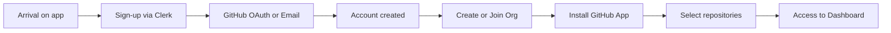
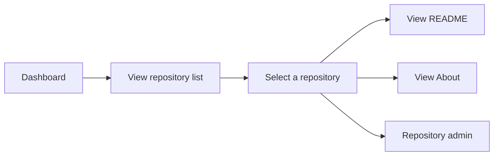
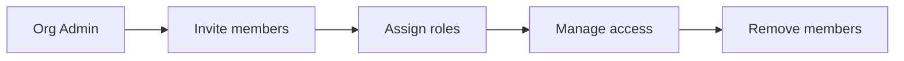

# Product Context - Functional Documentation

## Overview

This documentation describes the product features of the application from a business and user perspective. It is organized by functional domains and intended to be the single reference for understanding what the application does and how.

**Creation date**: 2025-10-17  
**Workflow**: Generated via audit-codebase-product  
**Global coverage**: ~65% (information extracted from existing code)

---

## 🎯 Application Objective

This application is a **B2B SaaS boilerplate** that allows organizations to:

- Manage their members and access (multi-tenant)
- Integrate their GitHub repositories
- Visualize and navigate their repositories from a centralized interface
- (Coming soon) Edit their Markdown documentation with AI assistance

---

## 📂 Functional Domains

The application is organized into **7 functional domains**:

| Domain                                              | Description                             | Status         | Coverage |
| --------------------------------------------------- | --------------------------------------- | -------------- | -------- |
| [**Authentication**](./authentication/)             | User authentication and sessions        | ✅ Implemented | 85%      |
| [**User Management**](./user-management/)           | User lifecycle management               | ✅ Implemented | 75%      |
| [**Organization**](./organization/)                 | Multi-tenant system with organizations  | ✅ Implemented | 70%      |
| [**GitHub Integration**](./github-integration/)     | GitHub App integration and repositories | ✅ Implemented | 80%      |
| [**Repository Dashboard**](./repository-dashboard/) | Repository visualization interface      | ✅ Implemented | 60%      |
| [**Administration**](./administration/)             | Administration features                 | ⚠️ Partial     | 40%      |
| [**Markdown Editor**](./markdown-editor/)           | Triple panel editor with AI             | 📝 Planned     | 10%      |

### Status Legend

- ✅ **Implemented**: Feature operational in production
- ⚠️ **Partial**: Feature partially implemented
- 📝 **Planned**: Feature in specification/development phase
- ❌ **Not implemented**: Feature identified but not yet developed

---

## 🚀 Main User Journeys

### 1. New User Onboarding

**Estimated duration**: 3-5 minutes

**Documentation**:

- [Sign-up Flow](./authentication/sign-up-flow.md)
- [Organization Creation](./organization/organization-creation.md)
- [GitHub Installation](./github-integration/installation-flow.md)

---

### 2. Repository Consultation

**Documentation**:

- [Repository List](./repository-dashboard/repository-list.md)
- [Repository Navigation](./repository-dashboard/repository-navigation.md)

---

### 3. Team Management (Organization)

**Documentation**:

- [Organization Members](./organization/organization-members.md)
- [Organization Roles](./organization/organization-roles.md)

---

## 🔑 Key Concepts

### Multi-Tenancy

The application operates in **multi-tenant** mode:

- Each **Organization** is an isolated tenant
- **Users** can belong to multiple Organizations
- All data is scoped by Organization
- Organization context is required to access the application

[→ Learn more](./organization/multi-tenancy.md)

---

### Roles and Permissions

**Two levels of roles**:

1. **Application Level**:
   - `Regular User` (default)
   - `Admin` (access to admin routes)

2. **Organization Level**:
   - Defined by `role` field (string)
   - Managed via Clerk Organizations
   - Exact permissions not documented in code

[→ Learn more](./user-management/user-roles.md)  
[→ Organization Roles](./organization/organization-roles.md)

---

### Organization Plans

**Available plans**:

- `FREE` - Free plan (default)
- `PRO` - Pro plan

⚠️ **Note**: Plan limits are not implemented in the current code.

[→ Learn more](./organization/organization-plans.md)

---

### GitHub Integration

**Two distinct GitHub integrations**:

1. **GitHub OAuth** (Authentication)
   - Used for sign-up/sign-in
   - Managed by Clerk
   - Retrieves email, name, photo

2. **GitHub App** (Repository Access)
   - Installation on GitHub account/org
   - Access to authorized repositories
   - REST API via Octokit

[→ Learn more](./github-integration/)

---

## 📊 External Integrations

| Service     | Usage                        | Domain                                        |
| ----------- | ---------------------------- | --------------------------------------------- |
| **Clerk**   | Auth + User + Org Management | Authentication, User Management, Organization |
| **GitHub**  | OAuth + App Integration      | Authentication, GitHub Integration            |
| **Sentry**  | Error Tracking + Performance | (All domains - technical)                     |
| **PostHog** | Analytics + Feature Flags    | (All domains - technical)                     |

[→ Detailed External Integrations](./authentication/README.md#external-integrations)

---

## 🔄 Data Synchronization

### Clerk → Application

**Implemented Clerk webhooks**:

- `user.created`, `user.updated`, `user.deleted`
- `organization.created`, `organization.updated`, `organization.deleted`
- `organizationMembership.created`, `organizationMembership.updated`, `organizationMembership.deleted`

**Behavior**: Unidirectional sync (Clerk = source of truth)

[→ Clerk Webhooks](./authentication/webhooks-clerk.md)

---

### GitHub → Application

**Current synchronization**: Manual

- User fetches available repositories via API
- User selects repositories to add
- Data stored in local DB

**GitHub Webhooks**: ❌ Not implemented

[→ Repository Sync](./github-integration/repository-sync.md)

---

## 📖 Documentation Navigation

### By Domain

Each domain has its own detailed documentation:

- [`/authentication/`](./authentication/) - 7 files
- [`/user-management/`](./user-management/) - 5 files
- [`/organization/`](./organization/) - 8 files
- [`/github-integration/`](./github-integration/) - 7 files
- [`/repository-dashboard/`](./repository-dashboard/) - 8 files
- [`/administration/`](./administration/) - 5 files
- [`/markdown-editor/`](./markdown-editor/) - 10 files (spec)

### Topic Index

**Authentication** :

- [Sign-up Flow](./authentication/sign-up-flow.md)
- [Sign-in Flow](./authentication/sign-in-flow.md)
- [GitHub OAuth](./authentication/github-oauth.md)
- [Session Management](./authentication/session-management.md)
- [Logout Flow](./authentication/logout-flow.md)
- [Webhooks Clerk](./authentication/webhooks-clerk.md)

**User Management** :

- [User Profile](./user-management/user-profile.md)
- [User Roles](./user-management/user-roles.md)
- [User Lifecycle](./user-management/user-lifecycle.md)
- [User Deletion](./user-management/user-deletion.md)

**Organization** :

- [Organization Creation](./organization/organization-creation.md)
- [Organization Members](./organization/organization-members.md)
- [Organization Roles](./organization/organization-roles.md)
- [Organization Plans](./organization/organization-plans.md)
- [Organization Selector](./organization/organization-selector.md)
- [Organization Lifecycle](./organization/organization-lifecycle.md)
- [Multi-Tenancy](./organization/multi-tenancy.md)

**GitHub Integration** :

- [GitHub App Setup](./github-integration/github-app-setup.md)
- [Installation Flow](./github-integration/installation-flow.md)
- [Repository Access](./github-integration/repository-access.md)
- [Repository Selection](./github-integration/repository-selection.md)
- [Repository Sync](./github-integration/repository-sync.md)
- [GitHub Webhooks](./github-integration/github-webhooks.md)

**Repository Dashboard** :

- [Dashboard Layout](./repository-dashboard/dashboard-layout.md)
- [Repository List](./repository-dashboard/repository-list.md)
- [Repository Switcher](./repository-dashboard/repository-switcher.md)
- [Repository Navigation](./repository-dashboard/repository-navigation.md)
- [README View](./repository-dashboard/readme-view.md)
- [About View](./repository-dashboard/about-view.md)
- [Admin View](./repository-dashboard/admin-view.md)

**Administration** :

- [Admin Roles](./administration/admin-roles.md)
- [Admin Routes](./administration/admin-routes.md)
- [Repository Admin](./administration/repository-admin.md)
- [System Management](./administration/system-management.md)

**Markdown Editor** (Planned):

- [README](./markdown-editor/README.md) - Spec complète

---

## 🎓 Going Further

### Technical Documentation

The product documentation is complemented by **technical documentation**:

- `context/technical/` - Architecture, patterns, tools

### Roadmap

Check the user stories and epics to see upcoming features:

- `roadmap/user-stories/` - Detailed user stories
- `roadmap/epics/` - Epics and major features

### Architecture Decision Records

Important technical decisions are documented in:

- Roadmap user stories (section "Technical Decisions")

---

## 🤝 Contribution

To update this documentation:

1. **Minor modifications**: Edit markdown files directly
2. **New domain**: Follow the structure of existing domains
3. **Major overhaul**: Re-run the `audit-codebase-product` workflow

---

## 📝 Version Notes

| Version | Date       | Changes                                              |
| ------- | ---------- | ---------------------------------------------------- |
| 1.0     | 2025-10-17 | Initial creation via audit-codebase-product workflow |

---

**Last updated**: 2025-10-17  
**Generated by**: ContextBuilder Agent (@context-agent)  
**Workflow**: audit-codebase-product v1.0
