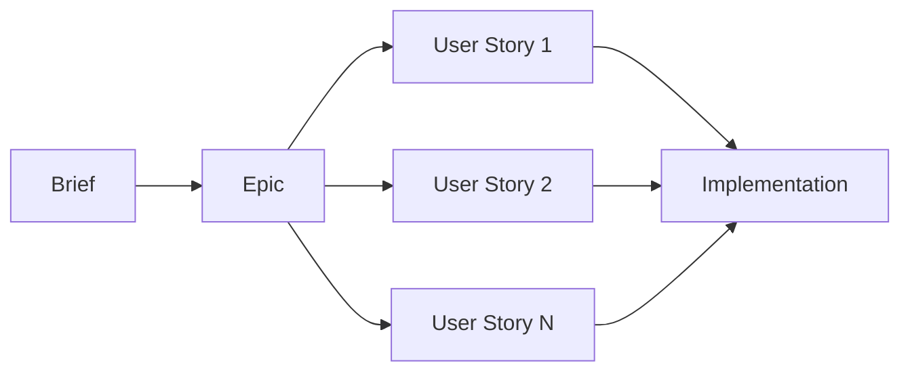

# Roadmap - Planning and Development

This folder contains all project planning and development artifacts, organized according to the Speiros methodology.

## Overview

The roadmap follows a three-level hierarchy:

1. **Briefs** - Initial feature requests or problems to solve
2. **Epics** - Groups of related user stories (major features)
3. **User Stories** - Detailed work units with technical specifications

## Structure

```
roadmap/
├── README.md (this file)
├── briefs/
│   └── brief-YYYY-MM-DD-name.md
├── epics/
│   └── epic-X-epic-name.md
└── user-stories/
    ├── user-story-X.Y-story-name.md
    ├── user-story-X.Y.Z-sub-story.md
    └── ...
```

## Creation Workflow

### 1. Brief → Epic → User Story



### 2. Speiros Workflow

The Speiros system transforms a brief into code through three phases:

```
Brief → [Product Agent] → Functional Story
      → [Spec Agent] → Technical Story
      → [Dev Agent] → Code + Tests + Technical Decisions + Context Enrichment
```

**Commands**:

```bash
# Phase 1: Create functional story
@product-agent *run-workflow

# Phase 2: Add technical specifications
@spec-agent *run-workflow

# Phase 3: Implement
@dev-agent *run-workflow
```

## Naming Conventions

### Briefs

Format: `brief-YYYY-MM-DD-short-name.md`

Examples:

- `brief-2025-10-15-triple-panel-view.md`
- `brief-2025-10-16-realtime-notifications.md`

### Epics

Format: `epic-X-epic-name.md`

Where `X` is a sequential number.

Examples:

- `epic-1-triple-panel-interface.md`
- `epic-2-context-engineering-system.md`
- `epic-3-realtime-features.md`

### User Stories

Format: `user-story-X.Y-story-name.md`

Where:

- `X` = Parent epic number
- `Y` = Sequential number within epic

For sub-stories: `user-story-X.Y.Z-sub-story-name.md`

Examples:

- `user-story-1.1-frontend-triple-panel.md`
- `user-story-1.2-backend-markdown-api.md`
- `user-story-2.1-audit-codebase-product-workflow.md`
- `user-story-2.1.1-create-product-template.md` (sub-story)

## Status and Tracking

User stories follow these statuses:

| Status                       | Description                  | Marker |
| ---------------------------- | ---------------------------- | ------ |
| **Draft**                    | Being written                | 📝     |
| **Ready for Review**         | Ready for review             | 👀     |
| **Ready for Implementation** | Approved, ready to implement | ✅     |
| **In Progress**              | Being implemented            | 🚧     |
| **Done**                     | Implemented and tested       | ✔️     |
| **Blocked**                  | Blocked by dependency        | 🚫     |
| **Cancelled**                | Cancelled                    | ❌     |

**In files**:

```yaml
## Metadata

- **Status**: Ready for Implementation
```

## Organization by Epic

Use numeric prefix to group stories by epic:

```
user-stories/
├── user-story-1.1-*.md    # Epic 1
├── user-story-1.2-*.md
├── user-story-1.3-*.md
├── user-story-2.1-*.md    # Epic 2
├── user-story-2.2-*.md
├── user-story-3.1-*.md    # Epic 3
└── ...
```

## Technical Decisions Documentation

### Overview

Technical decisions are documented directly in user stories, in the **"Dev Results > Technical Decisions"** section. This keeps a single source of truth and avoids duplication.

### Documentation Workflow

1. **Development**: Dev Agent implements a user story
2. **Documentation**: Dev Agent documents all decisions in "Technical Decisions" section of Dev Results
3. **Enrichment**: Dev Agent automatically enriches technical context from these decisions
4. **Traceability**: Bidirectional referencing User Story ↔ Context

### Context Integration

Technical decisions automatically enrich technical context:

- **Drizzle decisions** → `context/technical/tools/DRIZZLE.md`
- **Auth decisions** → `context/technical/tools/CLERKS.md`
- **Architecture decisions** → `context/technical/context/ARCHITECTURE.md`
- And other files based on decision nature

## Speiros Workflow Integration

### Intermediate Artifacts

During story development, intermediate artifacts are created in:

**`.speiros/artifacts/speiros-workflow/`**

These artifacts include:

- Working versions of brief
- Story iterations during Product/Spec phases
- Notes and research

### Final Deliverables

Once story is completed, final deliverables are:

- **Final User Story** → Saved in `roadmap/user-stories/` (with Dev Results and Technical Decisions)
- **Implemented Code** → In project source folders (`apps/`, `packages/`)
- **Enriched Technical Context** → Updated in `context/technical/` from story decisions

## Context Referencing

User stories should reference relevant context:

### Product Context Referencing

```markdown
## Product Context

This story impacts the following domains:

- `context/product/authentication/` - Authentication management
- `context/product/organization/` - Organization hierarchy
```

### Technical Context Referencing

```markdown
## Technical Context

This story uses the following technical components:

- `context/technical/tools/CLERKS.md` - Authentication service
- `context/technical/context/API.md` - API patterns
```

## Creating a New Story

### Method 1: Via Speiros (Recommended)

```bash
# 1. Create brief
@product-agent *create-brief
# > "I want to add real-time notifications"

# 2. Transform into user story
@product-agent *run-workflow

# 3. Add technical specs
@spec-agent *run-workflow

# 4. Implement
@dev-agent *run-workflow
```

### Method 2: Manually

1. Duplicate an existing user story template
2. Fill metadata (ID, title, epic, status, priority, estimation)
3. Write description and objectives
4. Define Acceptance Criteria (AC)
5. Break down into tasks/subtasks
6. Save in `roadmap/user-stories/`

## Prioritization

Use "Priority" field in metadata:

- **Critical**: Blocking bugs, security issues
- **High**: Core features, major refactorings
- **Medium**: Improvements, optimizations
- **Low**: Nice-to-have, polish

## Estimation

Use Fibonacci sequence for estimation:

- **1 point**: Very simple (< 1h)
- **2 points**: Simple (1-2h)
- **3 points**: Medium (2-4h)
- **5 points**: Complex (1 day)
- **8 points**: Very complex (2 days)
- **13 points**: Epic (should be broken down)

If story > 8 points, break it down into sub-stories.

## Resources

- **Workflows**: `.speiros/workflows/speiros-workflow.yaml`
- **Agents**: `.speiros/agents/speiros-workflow/`
- **Templates**: `.speiros/templates/speiros-workflow/`
- **Intermediate artifacts**: `.speiros/artifacts/speiros-workflow/`

## Statistics

```bash
# Count stories by status
grep -r "Status:" roadmap/user-stories/ | sort | uniq -c

# Count stories by epic
ls roadmap/user-stories/user-story-*.md | cut -d'-' -f3 | cut -d'.' -f1 | sort | uniq -c
```

---

**Version:** 3.0 (Restructuring US-3.1)  
**Last Updated:** 2025-01-17
