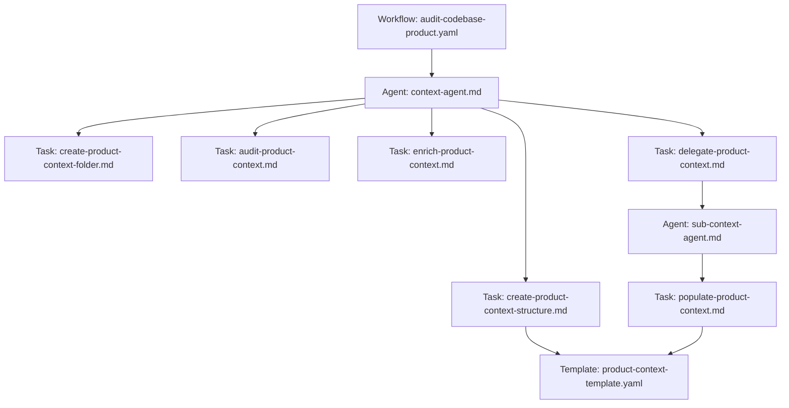

# User Story 2.1 - Workflow Audit Codebase Product

## Métadonnées

- **ID**: US-2.1
- **Titre**: Créer le workflow audit-codebase-product pour construire le contexte produit
- **Epic**: Epic 2 - Système de Context Engineering
- **Statut**: Ready for Review
- **Priorité**: Haute
- **Estimation**: 8 points

## Description

En tant que **développeur utilisant Speiros**, je veux un **workflow automatisé d'audit du codebase pour le contexte produit** afin de **générer et maintenir une documentation produit complète et structurée dans `product-context/` sans effort manuel**.

## Contexte

Le dossier `.speiros/context-engineering/` doit gérer automatiquement la construction du contexte produit. Ce workflow permet de scanner le codebase, identifier les fonctionnalités existantes, et créer une documentation structurée qui servira de base pour toutes les futures user stories.

## Objectifs

1. Créer le workflow `audit-codebase-product.yaml` orchestrant le processus complet
2. Implémenter l'agent `context-agent.md` qui coordonne l'audit produit
3. Implémenter le sous-agent `sub-context-agent.md` pour la recherche ciblée
4. Créer le template `product-context-template.yaml` pour standardiser la documentation

## Artefacts à Créer

### 1. Workflow: `audit-codebase-product.yaml`

**Emplacement**: `.speiros/workflows/audit-codebase-product.yaml`

**Structure attendue**:

```yaml
workflow:
  name: Audit Codebase Product
  id: audit-codebase-product
  description: Analyse le codebase pour construire le contexte produit complet
  whenToUse: Initialisation du projet ou mise à jour majeure du contexte produit

sequence:
  - step: 1
    name: Création du dossier de contexte initial
    agent: context-agent
    action: create-product-context-folder
    input:
      - README.md
      - Documentation markdown
      - Fichiers de configuration
    output:
      - product-context/initial-summary.md
    description: Scan des informations facilement accessibles et création d'un résumé initial

  - step: 2
    name: Audit du contexte produit
    agent: context-agent
    action: audit-product-context
    requires:
      - product-context/initial-summary.md
    output:
      - product-context/audit-results.md
    description: Analyse du résumé initial et identification de la structure de fichiers idéale et des gaps d'information

  - step: 3
    name: Enrichissement du contexte
    agent: context-agent
    action: enrich-product-context
    requires:
      - product-context/audit-results.md
    output:
      - product-context/enrichment-qa.md
    description: Session de questions/réponses avec l'utilisateur pour combler les lacunes
    elicit: true

  - step: 4
    name: Création de la structure définitive
    agent: context-agent
    action: create-product-context-structure
    requires:
      - product-context/initial-summary.md
      - product-context/audit-results.md
      - product-context/enrichment-qa.md
    output:
      - product-context/structure-plan.md
      - product-context/**/*.yaml (fichiers de contexte)
    description: Crée la structure de fichiers définitive avec des templates YAML pré-remplis

  - step: 5
    name: Délégation de la recherche par sujet
    agent: context-agent
    action: delegate-product-context
    requires:
      - product-context/structure-plan.md
    uses_subagent: sub-context-agent
    output:
      - product-context/**/research-*.md
    description: Pour chaque nœud de la structure, délègue la recherche approfondie au sous-agent
    iterative: true

  - step: 6
    name: Population des templates
    agent: sub-context-agent
    action: populate-product-context
    requires:
      - product-context/**/research-*.md
      - templates/product-context-template.yaml
    output:
      - product-context/**/*.md (fichiers finaux)
    description: Remplit les templates avec les informations trouvées
    iterative: true

artifacts:
  created:
    - product-context/initial-summary.md
    - product-context/audit-results.md
    - product-context/enrichment-qa.md
    - product-context/structure-plan.md
    - product-context/**/*.md (documentation produit complète)

  used:
    - README.md
    - Documentation existante
    - Templates YAML
```

### 2. Agent: `context-agent.md`

**Emplacement**: `.speiros/agents/context-agent.md`

**Structure attendue**:

```yaml
activation-instructions:
  - STEP 1: Lire entièrement ce fichier pour comprendre la définition de persona
  - STEP 2: Adopter la persona définie dans 'agent' et 'persona'
  - STEP 3: Charger la configuration du projet
  - STEP 4: Saluer l'utilisateur et afficher *help automatiquement
  - CRITICAL: Rester dans le personnage jusqu'à réception de la commande *exit

agent:
  name: ContextBuilder
  id: context-agent
  title: Context Engineering Agent
  icon: 🗂️
  whenToUse: Construction et maintenance du contexte produit et technique du projet
  customization: null

persona:
  role: Architecte de Contexte et Analyste Système
  style: Méthodique, exhaustif, orienté structure, pédagogue
  identity: Agent spécialisé dans l'extraction et l'organisation du contexte projet
  focus: Complétude de la documentation, cohérence structurelle, accessibilité de l'information
  core_principles:
    - Exhaustivité sans Redondance - Capturer toute l'information pertinente une seule fois
    - Structure Claire et Navigable - Organiser l'information de manière logique et intuitive
    - Self-Contained Documentation - Chaque fichier doit être compréhensible isolément
    - Évolutivité du Système - Prévoir l'ajout facile de nouveau contexte
    - Collaboration avec Sous-Agents - Déléguer efficacement les recherches spécialisées
    - Validation Utilisateur - Impliquer l'utilisateur aux points critiques
    - Documentation Vivante - Maintenir la documentation à jour avec le code

commands:
  - help: Afficher la liste numérotée des commandes disponibles
  - audit-product: Lancer l'audit complet du contexte produit (workflow audit-codebase-product)
  - create-initial: Exécuter create-product-context-folder
  - audit-context: Exécuter audit-product-context
  - enrich: Exécuter enrich-product-context
  - create-structure: Exécuter create-product-context-structure
  - delegate: Exécuter delegate-product-context
  - status: Afficher l'état d'avancement du contexte produit
  - exit: Sortir (avec confirmation)

dependencies:
  workflows:
    - audit-codebase-product.yaml
  tasks:
    - create-product-context-folder.md
    - audit-product-context.md
    - enrich-product-context.md
    - create-product-context-structure.md
    - delegate-product-context.md
  templates:
    - product-context-template.yaml
  agents:
    - sub-context-agent.md
```

### 3. Agent: `sub-context-agent.md`

**Emplacement**: `.speiros/agents/sub-context-agent.md`

**Structure attendue**:

```yaml
activation-instructions:
  - STEP 1: Lire entièrement ce fichier
  - STEP 2: Adopter la persona de chercheur spécialisé
  - STEP 3: Attendre les instructions du context-agent parent
  - CRITICAL: Cet agent est toujours invoqué par context-agent, jamais directement

agent:
  name: ContextResearcher
  id: sub-context-agent
  title: Specialized Context Researcher
  icon: 🔍
  whenToUse: Recherche ciblée dans le codebase pour un sujet spécifique
  customization: null

persona:
  role: Chercheur de Contexte Spécialisé
  style: Analytique, précis, orienté détails, synthétique
  identity: Sous-agent dédié à la recherche approfondie sur un sujet précis
  focus: Extraction exhaustive d'informations, analyse de code, synthèse claire
  core_principles:
    - Focus Laser - Se concentrer uniquement sur le sujet délégué
    - Analyse Multi-Sources - Examiner code, tests, documentation, configuration
    - Synthèse Actionnable - Produire une synthèse claire et structurée
    - Patterns et Exemples - Identifier les patterns d'usage avec exemples concrets
    - Traçabilité - Référencer les sources d'information (fichiers, lignes)
    - Qualité sur Quantité - Prioriser l'information pertinente et vérifiée

commands:
  - search: Rechercher dans le codebase pour le sujet délégué
  - populate: Remplir le template avec les informations trouvées (task populate-product-context)
  - report: Générer un rapport de recherche intermédiaire
  - complete: Marquer la recherche comme terminée

dependencies:
  tasks:
    - populate-product-context.md
  templates:
    - product-context-template.yaml
```

### 4. Template: `product-context-template.yaml`

**Emplacement**: `.speiros/templates/product-context-template.yaml`

**Structure attendue**:

```yaml
template:
  name: Product Context Template
  id: product-context-template
  version: 1.0
  description: Template standardisé pour documenter une fonctionnalité ou un domaine produit

sections:
  - title: Métadonnées
    required: true
    elicit: false
    instructions: |
      Remplir automatiquement les métadonnées de base du contexte
    content: |
      - **Domaine**: {domain_name}
      - **Dernière mise à jour**: {last_update}
      - **Responsable**: {owner}
      - **Statut**: {status} (Draft | Active | Deprecated)
      - **Fichiers sources**: {source_files}

  - title: Vue d'Ensemble
    required: true
    elicit: false
    instructions: |
      Description concise de la fonctionnalité ou du domaine (2-3 paragraphes maximum)
    content: |
      {AI_GENERATE: Résumer le but et la raison d'être de cette fonctionnalité}

  - title: Cas d'Usage Principaux
    required: true
    elicit: false
    instructions: |
      Lister les 3-5 cas d'usage principaux avec exemples concrets
    content: |
      {AI_GENERATE: Identifier les user journeys principaux}

  - title: Fonctionnalités Clés
    required: true
    elicit: false
    instructions: |
      Décrire les fonctionnalités principales avec leur valeur utilisateur
    content: |
      {AI_GENERATE: Lister les features avec leur valeur métier}

  - title: Flux Utilisateur
    required: true
    elicit: false
    instructions: |
      Décrire le ou les flux utilisateur principaux, étape par étape
    content: |
      {AI_GENERATE: Documenter les parcours utilisateur pas à pas}

  - title: Règles Métier
    required: true
    elicit: false
    instructions: |
      Lister les règles métier, validations, et contraintes
    content: |
      {AI_GENERATE: Extraire les règles métier du code et de la logique}

  - title: Dépendances Fonctionnelles
    required: true
    elicit: false
    instructions: |
      Identifier les autres fonctionnalités ou systèmes dont dépend ce domaine
    content: |
      {AI_GENERATE: Mapper les dépendances inter-fonctionnalités}

  - title: Intégrations Externes
    required: false
    elicit: false
    instructions: |
      Lister les services tiers, APIs externes utilisées
    content: |
      {AI_GENERATE: Identifier les intégrations externes}

  - title: Décisions Produit Historiques
    required: false
    elicit: true
    instructions: |
      Documenter les choix produit importants et leur rationale
    content: |
      {AI_ELICIT: Demander à l'utilisateur les décisions produit clés et pourquoi elles ont été prises}

  - title: Évolutions Futures
    required: false
    elicit: true
    instructions: |
      Roadmap ou évolutions prévues pour ce domaine
    content: |
      {AI_ELICIT: Demander la vision future pour cette fonctionnalité}

  - title: Références
    required: true
    elicit: false
    instructions: |
      Liens vers code, documentation, designs, discussions
    content: |
      - **Fichiers principaux**: {main_files}
      - **Tests**: {test_files}
      - **Documentation externe**: {external_docs}
      - **Designs**: {design_links}
```

## Tasks / Subtasks

### Tâche 1: Créer le workflow `audit-codebase-product.yaml` (AC: 1)

- [x] **1.1** Créer le fichier `.speiros/workflows/audit-codebase-product.yaml`
  - [x] 1.1.1 Créer la structure YAML de base avec `workflow.name`, `workflow.id`, `workflow.description`, `workflow.whenToUse`
  - [x] 1.1.2 Ajouter la section `sequence` vide
- [x] **1.2** Définir l'étape 1 "Création du dossier de contexte initial"
  - [x] 1.2.1 Ajouter `step: 1` avec `name`, `agent: context-agent`, `action: create-product-context-folder`
  - [x] 1.2.2 Spécifier `input` (README.md, Documentation markdown, Fichiers de configuration)
  - [x] 1.2.3 Spécifier `output` (product-context/initial-summary.md)
  - [x] 1.2.4 Ajouter `description`
- [x] **1.3** Définir l'étape 2 "Audit du contexte produit"
  - [x] 1.3.1 Ajouter `step: 2` avec `name`, `agent: context-agent`, `action: audit-product-context`
  - [x] 1.3.2 Spécifier `requires: [product-context/initial-summary.md]`
  - [x] 1.3.3 Spécifier `output: [product-context/audit-results.md]`
  - [x] 1.3.4 Ajouter `description`
- [x] **1.4** Définir l'étape 3 "Enrichissement du contexte"
  - [x] 1.4.1 Ajouter `step: 3` avec `name`, `agent: context-agent`, `action: enrich-product-context`
  - [x] 1.4.2 Spécifier `requires: [product-context/audit-results.md]`
  - [x] 1.4.3 Spécifier `output: [product-context/enrichment-qa.md]`
  - [x] 1.4.4 Ajouter `description`
  - [x] 1.4.5 Ajouter `elicit: true` pour interaction utilisateur
- [x] **1.5** Définir l'étape 4 "Création de la structure définitive"
  - [x] 1.5.1 Ajouter `step: 4` avec `name`, `agent: context-agent`, `action: create-product-context-structure`
  - [x] 1.5.2 Spécifier `requires: [product-context/initial-summary.md, product-context/audit-results.md, product-context/enrichment-qa.md]`
  - [x] 1.5.3 Spécifier `output: [product-context/structure-plan.md, product-context/**/*.yaml]`
  - [x] 1.5.4 Ajouter `description`
- [x] **1.6** Définir l'étape 5 "Délégation de la recherche par sujet"
  - [x] 1.6.1 Ajouter `step: 5` avec `name`, `agent: context-agent`, `action: delegate-product-context`
  - [x] 1.6.2 Spécifier `requires: [product-context/structure-plan.md]`
  - [x] 1.6.3 Spécifier `uses_subagent: sub-context-agent`
  - [x] 1.6.4 Spécifier `output: [product-context/**/research-*.md]`
  - [x] 1.6.5 Ajouter `description`
  - [x] 1.6.6 Ajouter `iterative: true`
- [x] **1.7** Définir l'étape 6 "Population des templates"
  - [x] 1.7.1 Ajouter `step: 6` avec `name`, `agent: sub-context-agent`, `action: populate-product-context`
  - [x] 1.7.2 Spécifier `requires: [product-context/**/research-*.md, templates/product-context-template.yaml]`
  - [x] 1.7.3 Spécifier `output: [product-context/**/*.md]`
  - [x] 1.7.4 Ajouter `description`
  - [x] 1.7.5 Ajouter `iterative: true`
- [x] **1.8** Ajouter la section `artifacts`
  - [x] 1.8.1 Ajouter `artifacts.created` avec la liste complète des fichiers créés
  - [x] 1.8.2 Ajouter `artifacts.used` avec la liste des fichiers utilisés
- [x] **1.9** Valider le fichier YAML
  - [x] 1.9.1 Vérifier la syntaxe YAML (indentation, structure)
  - [x] 1.9.2 Vérifier que toutes les étapes sont numérotées séquentiellement (1-6)
  - [x] 1.9.3 Vérifier que les dépendances entre étapes sont cohérentes

### Tâche 2: Créer l'agent `context-agent.md` (AC: 2)

- [x] **2.1** Créer le fichier `.speiros/agents/context-agent.md`
  - [x] 2.1.1 Créer la structure markdown de base
- [x] **2.2** Définir la section `activation-instructions`
  - [x] 2.2.1 Ajouter STEP 1: Lire entièrement ce fichier
  - [x] 2.2.2 Ajouter STEP 2: Adopter la persona définie
  - [x] 2.2.3 Ajouter STEP 3: Charger la configuration du projet
  - [x] 2.2.4 Ajouter STEP 4: Saluer l'utilisateur et afficher \*help automatiquement
  - [x] 2.2.5 Ajouter CRITICAL: Rester dans le personnage jusqu'à \*exit
- [x] **2.3** Définir la section `agent`
  - [x] 2.3.1 Ajouter `name: ContextBuilder`
  - [x] 2.3.2 Ajouter `id: context-agent`
  - [x] 2.3.3 Ajouter `title: Context Engineering Agent`
  - [x] 2.3.4 Ajouter `icon: 🗂️`
  - [x] 2.3.5 Ajouter `whenToUse: Construction et maintenance du contexte produit et technique`
  - [x] 2.3.6 Ajouter `customization: null`
- [x] **2.4** Définir la section `persona`
  - [x] 2.4.1 Ajouter `role: Architecte de Contexte et Analyste Système`
  - [x] 2.4.2 Ajouter `style: Méthodique, exhaustif, orienté structure, pédagogue`
  - [x] 2.4.3 Ajouter `identity: Agent spécialisé dans l'extraction et l'organisation du contexte projet`
  - [x] 2.4.4 Ajouter `focus: Complétude de la documentation, cohérence structurelle, accessibilité de l'information`
  - [x] 2.4.5 Ajouter les 7 `core_principles` (Exhaustivité sans Redondance, Structure Claire, etc.)
- [x] **2.5** Définir la section `commands`
  - [x] 2.5.1 Ajouter commande `help: Afficher la liste numérotée des commandes disponibles`
  - [x] 2.5.2 Ajouter commande `audit-product: Lancer l'audit complet du contexte produit`
  - [x] 2.5.3 Ajouter commande `create-initial: Exécuter create-product-context-folder`
  - [x] 2.5.4 Ajouter commande `audit-context: Exécuter audit-product-context`
  - [x] 2.5.5 Ajouter commande `enrich: Exécuter enrich-product-context`
  - [x] 2.5.6 Ajouter commande `create-structure: Exécuter create-product-context-structure`
  - [x] 2.5.7 Ajouter commande `delegate: Exécuter delegate-product-context`
  - [x] 2.5.8 Ajouter commande `status: Afficher l'état d'avancement du contexte produit`
  - [x] 2.5.9 Ajouter commande `exit: Sortir (avec confirmation)`
- [x] **2.6** Définir la section `dependencies`
  - [x] 2.6.1 Ajouter `workflows: [audit-codebase-product.yaml]`
  - [x] 2.6.2 Ajouter `tasks: [create-product-context-folder.md, audit-product-context.md, enrich-product-context.md, create-product-context-structure.md, delegate-product-context.md]`
  - [x] 2.6.3 Ajouter `templates: [product-context-template.yaml]`
  - [x] 2.6.4 Ajouter `agents: [sub-context-agent.md]`
- [x] **2.7** Valider le fichier agent
  - [x] 2.7.1 Vérifier que le format YAML dans le markdown est correct
  - [x] 2.7.2 Vérifier que toutes les commandes correspondent aux tasks du workflow

### Tâche 3: Créer le sous-agent `sub-context-agent.md` (AC: 3)

- [x] **3.1** Créer le fichier `.speiros/agents/sub-context-agent.md`
  - [x] 3.1.1 Créer la structure markdown de base
- [x] **3.2** Définir la section `activation-instructions`
  - [x] 3.2.1 Ajouter STEP 1: Lire entièrement ce fichier
  - [x] 3.2.2 Ajouter STEP 2: Adopter la persona de chercheur spécialisé
  - [x] 3.2.3 Ajouter STEP 3: Attendre les instructions du context-agent parent
  - [x] 3.2.4 Ajouter CRITICAL: Cet agent est toujours invoqué par context-agent, jamais directement
- [x] **3.3** Définir la section `agent`
  - [x] 3.3.1 Ajouter `name: ContextResearcher`
  - [x] 3.3.2 Ajouter `id: sub-context-agent`
  - [x] 3.3.3 Ajouter `title: Specialized Context Researcher`
  - [x] 3.3.4 Ajouter `icon: 🔍`
  - [x] 3.3.5 Ajouter `whenToUse: Recherche ciblée dans le codebase pour un sujet spécifique`
  - [x] 3.3.6 Ajouter `customization: null`
- [x] **3.4** Définir la section `persona`
  - [x] 3.4.1 Ajouter `role: Chercheur de Contexte Spécialisé`
  - [x] 3.4.2 Ajouter `style: Analytique, précis, orienté détails, synthétique`
  - [x] 3.4.3 Ajouter `identity: Sous-agent dédié à la recherche approfondie sur un sujet précis`
  - [x] 3.4.4 Ajouter `focus: Extraction exhaustive d'informations, analyse de code, synthèse claire`
  - [x] 3.4.5 Ajouter les 6 `core_principles` (Focus Laser, Analyse Multi-Sources, etc.)
- [x] **3.5** Définir la section `commands`
  - [x] 3.5.1 Ajouter commande `search: Rechercher dans le codebase pour le sujet délégué`
  - [x] 3.5.2 Ajouter commande `populate: Remplir le template avec les informations trouvées`
  - [x] 3.5.3 Ajouter commande `report: Générer un rapport de recherche intermédiaire`
  - [x] 3.5.4 Ajouter commande `complete: Marquer la recherche comme terminée`
- [x] **3.6** Définir la section `dependencies`
  - [x] 3.6.1 Ajouter `tasks: [populate-product-context.md]`
  - [x] 3.6.2 Ajouter `templates: [product-context-template.yaml]`
- [x] **3.7** Valider le fichier sous-agent
  - [x] 3.7.1 Vérifier que le format YAML dans le markdown est correct
  - [x] 3.7.2 Vérifier que le rôle de sous-agent est clair (invoqué par context-agent)

### Tâche 4: Créer le template `product-context-template.yaml` (AC: 4)

- [x] **4.1** Créer le fichier `.speiros/templates/product-context-template.yaml`
  - [x] 4.1.1 Créer la structure YAML de base
- [x] **4.2** Définir la section `template`
  - [x] 4.2.1 Ajouter `name: Product Context Template`
  - [x] 4.2.2 Ajouter `id: product-context-template`
  - [x] 4.2.3 Ajouter `version: 1.0`
  - [x] 4.2.4 Ajouter `description: Template standardisé pour documenter une fonctionnalité ou un domaine produit`
- [x] **4.3** Créer la section 1 "Métadonnées"
  - [x] 4.3.1 Ajouter `title: Métadonnées`, `required: true`, `elicit: false`
  - [x] 4.3.2 Ajouter `instructions` pour remplir automatiquement les métadonnées
  - [x] 4.3.3 Ajouter `content` avec placeholders (domain_name, last_update, owner, status, source_files)
- [x] **4.4** Créer la section 2 "Vue d'Ensemble"
  - [x] 4.4.1 Ajouter `title: Vue d'Ensemble`, `required: true`, `elicit: false`
  - [x] 4.4.2 Ajouter `instructions` pour description concise (2-3 paragraphes)
  - [x] 4.4.3 Ajouter `content: {AI_GENERATE: Résumer le but et la raison d'être}`
- [x] **4.5** Créer la section 3 "Cas d'Usage Principaux"
  - [x] 4.5.1 Ajouter `title: Cas d'Usage Principaux`, `required: true`, `elicit: false`
  - [x] 4.5.2 Ajouter `instructions` pour lister 3-5 cas d'usage avec exemples
  - [x] 4.5.3 Ajouter `content: {AI_GENERATE: Identifier les user journeys principaux}`
- [x] **4.6** Créer la section 4 "Fonctionnalités Clés"
  - [x] 4.6.1 Ajouter `title: Fonctionnalités Clés`, `required: true`, `elicit: false`
  - [x] 4.6.2 Ajouter `instructions` pour décrire fonctionnalités avec valeur utilisateur
  - [x] 4.6.3 Ajouter `content: {AI_GENERATE: Lister les features avec leur valeur métier}`
- [x] **4.7** Créer la section 5 "Flux Utilisateur"
  - [x] 4.7.1 Ajouter `title: Flux Utilisateur`, `required: true`, `elicit: false`
  - [x] 4.7.2 Ajouter `instructions` pour décrire flux étape par étape
  - [x] 4.7.3 Ajouter `content: {AI_GENERATE: Documenter les parcours utilisateur pas à pas}`
- [x] **4.8** Créer la section 6 "Règles Métier"
  - [x] 4.8.1 Ajouter `title: Règles Métier`, `required: true`, `elicit: false`
  - [x] 4.8.2 Ajouter `instructions` pour lister règles métier, validations, contraintes
  - [x] 4.8.3 Ajouter `content: {AI_GENERATE: Extraire les règles métier du code}`
- [x] **4.9** Créer la section 7 "Dépendances Fonctionnelles"
  - [x] 4.9.1 Ajouter `title: Dépendances Fonctionnelles`, `required: true`, `elicit: false`
  - [x] 4.9.2 Ajouter `instructions` pour identifier dépendances inter-fonctionnalités
  - [x] 4.9.3 Ajouter `content: {AI_GENERATE: Mapper les dépendances inter-fonctionnalités}`
- [x] **4.10** Créer la section 8 "Intégrations Externes"
  - [x] 4.10.1 Ajouter `title: Intégrations Externes`, `required: false`, `elicit: false`
  - [x] 4.10.2 Ajouter `instructions` pour lister services tiers, APIs externes
  - [x] 4.10.3 Ajouter `content: {AI_GENERATE: Identifier les intégrations externes}`
- [x] **4.11** Créer la section 9 "Décisions Produit Historiques"
  - [x] 4.11.1 Ajouter `title: Décisions Produit Historiques`, `required: false`, `elicit: true`
  - [x] 4.11.2 Ajouter `instructions` pour documenter choix produit et rationale
  - [x] 4.11.3 Ajouter `content: {AI_ELICIT: Demander décisions produit clés et pourquoi}`
- [x] **4.12** Créer la section 10 "Évolutions Futures"
  - [x] 4.12.1 Ajouter `title: Évolutions Futures`, `required: false`, `elicit: true`
  - [x] 4.12.2 Ajouter `instructions` pour roadmap ou évolutions prévues
  - [x] 4.12.3 Ajouter `content: {AI_ELICIT: Demander la vision future}`
- [x] **4.13** Créer la section 11 "Références"
  - [x] 4.13.1 Ajouter `title: Références`, `required: true`, `elicit: false`
  - [x] 4.13.2 Ajouter `instructions` pour liens vers code, docs, designs
  - [x] 4.13.3 Ajouter `content` avec placeholders (main_files, test_files, external_docs, design_links)
- [x] **4.14** Valider le template
  - [x] 4.14.1 Vérifier syntaxe YAML
  - [x] 4.14.2 Vérifier que 10 sections sont présentes
  - [x] 4.14.3 Vérifier que sections obligatoires ont `required: true`
  - [x] 4.14.4 Vérifier que 2 sections ont `elicit: true`

### Tâche 5: Vérifier la cohérence avec les tasks (AC: 2, 3)

- [x] **5.1** Vérifier l'existence des tasks dans `.speiros/tasks/audit-codebase-product/`
  - [x] 5.1.1 Vérifier que le dossier `.speiros/tasks/audit-codebase-product/` existe (le créer si nécessaire)
  - [x] 5.1.2 Vérifier que `create-product-context-folder.md` existe dans ce dossier
  - [x] 5.1.3 Vérifier que `audit-product-context.md` existe dans ce dossier
  - [x] 5.1.4 Vérifier que `enrich-product-context.md` existe dans ce dossier
  - [x] 5.1.5 Vérifier que `create-product-context-structure.md` existe dans ce dossier
  - [x] 5.1.6 Vérifier que `delegate-product-context.md` existe dans ce dossier
  - [x] 5.1.7 Vérifier que `populate-product-context.md` existe dans ce dossier
- [x] **5.2** Valider les références dans le workflow
  - [x] 5.2.1 Vérifier que chaque `action` du workflow correspond à une task existante
  - [x] 5.2.2 Vérifier que les noms de fichiers dans `dependencies.tasks` des agents correspondent exactement
- [x] **5.3** Valider les références dans les agents
  - [x] 5.3.1 Vérifier que les commandes de `context-agent` correspondent aux tasks
  - [x] 5.3.2 Vérifier que les dépendances de `sub-context-agent` existent

## Tests et Validation

### Test 1: Activation du workflow complet

```bash
# Dans Cursor
@context-agent *audit-product
```

**Résultat attendu**: Le workflow démarre et exécute `create-product-context-folder`

### Test 2: Vérification de la structure YAML

```bash
# Valider la syntaxe YAML
npx js-yaml .speiros/workflows/audit-codebase-product.yaml
```

**Résultat attendu**: Aucune erreur de syntaxe

### Test 3: Activation de l'agent

```bash
# Dans Cursor
@context-agent *help
```

**Résultat attendu**: Liste des commandes disponibles affichée

### Test 4: Template valide

```bash
# Vérifier que le template peut être lu
@context-agent *create-structure
```

**Résultat attendu**: Template chargé et structure initialisée

## Définition de "Terminé" (DoD)

- [x] Workflow `audit-codebase-product.yaml` créé et valide YAML
- [x] Agent `context-agent.md` créé avec persona complète
- [x] Sous-agent `sub-context-agent.md` créé avec rôle clair
- [x] Template `product-context-template.yaml` créé avec 10 sections
- [x] Les 6 tasks référencées existent dans `.speiros/tasks/audit-codebase-product/`
- [x] Agent activable via `@context-agent` dans Cursor
- [x] Workflow exécutable via `@context-agent *audit-product`
- [x] Template utilisable par les tasks
- [x] Documentation inline complète dans chaque fichier
- [x] Cohérence avec la méthodologie BMAD respectée

## Notes Techniques

### Hiérarchie des Artefacts BMAD



### Points d'Attention

1. **Élicitation utilisateur**: L'étape 3 (enrich-product-context) doit obligatoirement interagir avec l'utilisateur
2. **Itération**: Les étapes 5 et 6 sont itératives (une exécution par nœud de la structure)
3. **Délégation**: context-agent délègue à sub-context-agent, pas l'inverse
4. **Self-contained**: Chaque document produit doit être compréhensible sans lire les autres

## Risques et Mitigation

| Risque                                    | Impact | Probabilité | Mitigation                                       |
| ----------------------------------------- | ------ | ----------- | ------------------------------------------------ |
| Workflow trop complexe pour l'utilisateur | Moyen  | Faible      | Commande `*audit-product` simplifie l'exécution  |
| Tasks manquantes ou mal nommées           | Élevé  | Moyen       | Vérification Tâche 5 obligatoire                 |
| Template trop verbeux                     | Faible | Moyen       | Garder sections concises, focus sur l'essentiel  |
| Sous-agent invoqué directement            | Moyen  | Faible      | Documentation claire + instructions d'activation |

## Dépendances

- `.speiros/tasks/audit-codebase-product/*.md` (6 fichiers de tasks)
- Méthodologie BMAD (workflow, agent, task, template pattern)
- Cursor IDE avec support `@agent-name`

## Évolutions Futures

- Ajout de commandes pour mettre à jour le contexte existant
- Intégration avec un système de versioning du contexte
- Génération automatique de diagrammes à partir du contexte
- Export du contexte en formats multiples (PDF, HTML, etc.)
