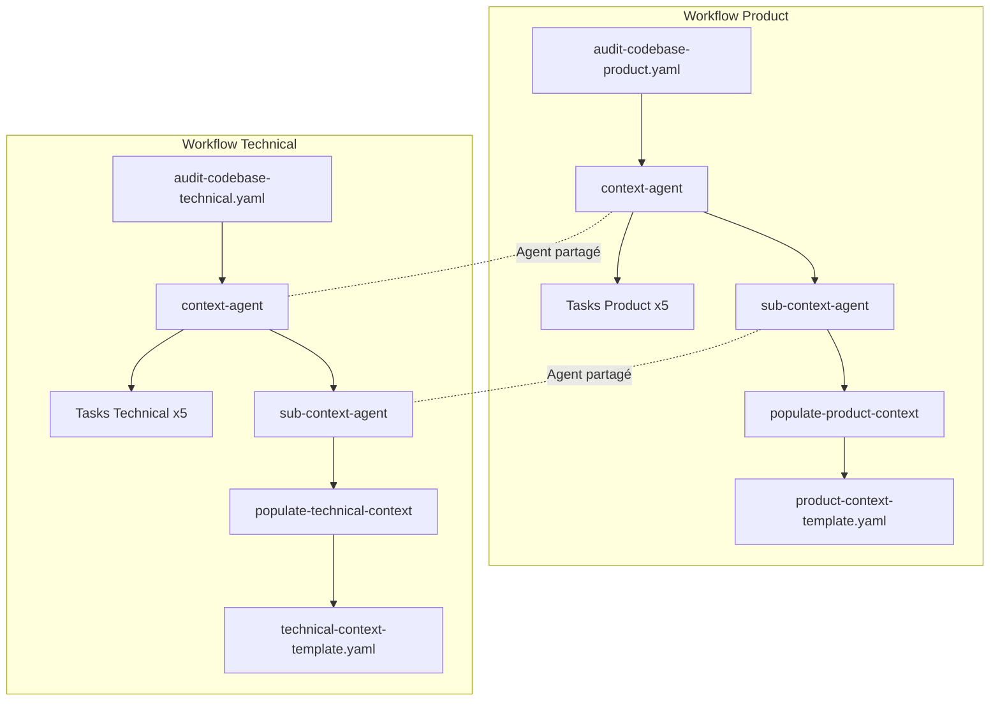

# User Story 2.2 - Workflow Audit Codebase Technical

## Métadonnées

- **ID**: US-2.2
- **Titre**: Créer le workflow audit-codebase-technical pour construire le contexte technique
- **Epic**: Epic 2 - Système de Context Engineering
- **Statut**: Draft
- **Priorité**: Haute
- **Estimation**: 6 points

## Description

En tant que **développeur utilisant Speiros**, je veux un **workflow automatisé d'audit du codebase pour le contexte technique** afin de **générer et maintenir une documentation technique complète (architecture, guidelines, outils) dans `technical-context/` sans effort manuel**.

## Contexte

Suite à la création du workflow `audit-codebase-product`, ce workflow parallèle se concentre sur le contexte technique : architecture, patterns de code, guidelines de développement, configuration des outils, décisions techniques historiques. Il utilise la même structure et méthodologie mais cible des informations techniques plutôt que fonctionnelles.

## Objectifs

1. Dupliquer et adapter le workflow `audit-codebase-product.yaml` → `audit-codebase-technical.yaml`
2. Réutiliser les agents `context-agent.md` et `sub-context-agent.md` (déjà générique)
3. Créer le template `technical-context-template.yaml` adapté à la documentation technique
4. Assurer la cohérence avec les tasks techniques existantes

## Artefacts à Créer

### 1. Workflow: `audit-codebase-technical.yaml`

**Emplacement**: `.speiros/workflows/audit-codebase-technical.yaml`

**Structure attendue**:

```yaml
workflow:
  name: Audit Codebase Technical
  id: audit-codebase-technical
  description: Analyse le codebase pour construire le contexte technique complet
  whenToUse: Initialisation du projet ou mise à jour majeure du contexte technique

sequence:
  - step: 1
    name: Création du dossier de contexte technique initial
    agent: context-agent
    action: create-technical-context-folder
    input:
      - Architecture files
      - Configuration files
      - Technical documentation
      - Test files
    output:
      - .speiros/context-engineering/technical-context-artifacts/initial-summary.md
    description: Scan des fichiers techniques et création d'un résumé initial

  - step: 2
    name: Audit du contexte technique
    agent: context-agent
    action: audit-technical-context
    requires:
      - .speiros/context-engineering/technical-context-artifacts/initial-summary.md
    output:
      - .speiros/context-engineering/technical-context-artifacts/audit-results.md
    description: Analyse du résumé initial et identification de la structure technique idéale et des gaps

  - step: 3
    name: Enrichissement du contexte technique
    agent: context-agent
    action: enrich-technical-context
    requires:
      - .speiros/context-engineering/technical-context-artifacts/audit-results.md
    output:
      - .speiros/context-engineering/technical-context-artifacts/enrichment-qa.md
    description: Session de questions/réponses avec l'utilisateur pour combler les lacunes techniques
    elicit: true

  - step: 4
    name: Création de la structure technique définitive
    agent: context-agent
    action: create-technical-context-structure
    requires:
      - .speiros/context-engineering/technical-context-artifacts/initial-summary.md
      - .speiros/context-engineering/technical-context-artifacts/audit-results.md
      - .speiros/context-engineering/technical-context-artifacts/enrichment-qa.md
    output:
      - .speiros/context-engineering/technical-context-artifacts/structure-plan.md
    description: Crée le plan de structure technique définitive
    note: YAML templates are not created in this step anymore

  - step: 5
    name: Délégation de la recherche technique par sujet
    agent: context-agent
    action: delegate-technical-context
    requires:
      - .speiros/context-engineering/technical-context-artifacts/structure-plan.md
    uses_subagent: sub-context-agent
    output:
      - .speiros/context-engineering/technical-context-artifacts/research/**/*.md
    description: Pour chaque nœud technique, délègue la recherche approfondie au sous-agent
    iterative: true

  - step: 6
    name: Population des templates techniques
    agent: sub-context-agent
    action: populate-technical-context
    requires:
      - .speiros/context-engineering/technical-context-artifacts/research/**/*.md
      - .speiros/templates/technical-context-template.yaml
    output:
      - technical-context/**/*.md
    description: Remplit les templates avec les informations techniques trouvées et écrit les fichiers finaux dans technical-context/
    iterative: true

artifacts:
  created:
    intermediary:
      - .speiros/context-engineering/technical-context-artifacts/initial-summary.md
      - .speiros/context-engineering/technical-context-artifacts/audit-results.md
      - .speiros/context-engineering/technical-context-artifacts/enrichment-qa.md
      - .speiros/context-engineering/technical-context-artifacts/structure-plan.md
      - .speiros/context-engineering/technical-context-artifacts/research/**/*.md
    final:
      - technical-context/**/*.md

  used:
    - Architecture files
    - Configuration files
    - Test files
    - .speiros/templates/technical-context-template.yaml

structure_examples:
  - technical-context/context/API.md
  - technical-context/context/ARCHITECTURE.md
  - technical-context/context/DATABASE.md
  - technical-context/context/ERROR-HANDLING.md
  - technical-context/context/TESTS.md
  - technical-context/tools/CLERKS.md
  - technical-context/tools/DRIZZLE.md
  - context/architecture-decision-records/TECHNICAL-CHOICE.md
  - context/architecture-decision-records/TROUBLESHOOTING.md
```

### 2. Template: `technical-context-template.yaml`

**Emplacement**: `.speiros/templates/technical-context-template.yaml`

**Structure attendue**:

```yaml
template:
  name: Technical Context Template
  id: technical-context-template
  version: 1.0
  description: Template standardisé pour documenter un aspect technique, un outil, ou une guideline

sections:
  - title: Métadonnées
    required: true
    elicit: false
    instructions: |
      Remplir automatiquement les métadonnées techniques
    content: |
      - **Catégorie**: {category} (Architecture | Tool | Pattern | Guideline | ADR)
      - **Dernière mise à jour**: {last_update}
      - **Responsable**: {owner}
      - **Statut**: {status} (Active | Deprecated | Experimental)
      - **Fichiers sources**: {source_files}

  - title: Vue d'Ensemble Technique
    required: true
    elicit: false
    instructions: |
      Description concise du composant technique, outil ou pattern (2-3 paragraphes)
    content: |
      {AI_GENERATE: Résumer le rôle technique et la raison d'être}

  - title: Architecture & Design
    required: true
    elicit: false
    instructions: |
      Décrire l'architecture, les patterns utilisés, les choix de design
    content: |
      {AI_GENERATE: Analyser l'architecture et les patterns de conception}

  - title: Configuration & Setup
    required: true
    elicit: false
    instructions: |
      Documenter la configuration nécessaire, variables d'environnement, setup
    content: |
      {AI_GENERATE: Extraire la configuration et les étapes de setup}

  - title: API & Interfaces
    required: false
    elicit: false
    instructions: |
      Décrire les APIs publiques, interfaces, contrats
    content: |
      {AI_GENERATE: Documenter les interfaces exposées et leur utilisation}

  - title: Patterns & Best Practices
    required: true
    elicit: false
    instructions: |
      Identifier les patterns de code, conventions, best practices
    content: |
      {AI_GENERATE: Extraire les patterns et conventions du code existant}

  - title: Exemples d'Usage
    required: true
    elicit: false
    instructions: |
      Fournir des exemples concrets d'utilisation avec code
    content: |
      {AI_GENERATE: Trouver et documenter des exemples réels du codebase}

  - title: Dépendances Techniques
    required: true
    elicit: false
    instructions: |
      Lister les dépendances (packages, services, autres modules)
    content: |
      {AI_GENERATE: Mapper les dépendances techniques}

  - title: Tests & Validation
    required: true
    elicit: false
    instructions: |
      Décrire la stratégie de test, exemples de tests, couverture
    content: |
      {AI_GENERATE: Analyser les tests existants et la stratégie de testing}

  - title: Décisions Techniques Historiques
    required: false
    elicit: true
    instructions: |
      Documenter les choix techniques importants et leur rationale (ADR style)
    content: |
      {AI_ELICIT: Demander à l'utilisateur les décisions techniques clés et leur contexte}

  - title: Troubleshooting & FAQ
    required: false
    elicit: false
    instructions: |
      Documenter les problèmes courants et leurs solutions
    content: |
      {AI_GENERATE: Identifier les patterns d'erreurs et solutions dans le code/logs}

  - title: Roadmap Technique
    required: false
    elicit: true
    instructions: |
      Évolutions techniques prévues, refactoring, améliorations
    content: |
      {AI_ELICIT: Demander la vision technique future pour ce composant}

  - title: Références
    required: true
    elicit: false
    instructions: |
      Liens vers code, documentation, specs, discussions
    content: |
      - **Fichiers principaux**: {main_files}
      - **Tests**: {test_files}
      - **Configuration**: {config_files}
      - **Documentation externe**: {external_docs}
      - **Specifications**: {spec_links}
```

### 3. Adaptation des Agents (Documentation uniquement)

Les agents `context-agent.md` et `sub-context-agent.md` sont déjà conçus pour être génériques. Il faut simplement documenter comment ils s'utilisent pour le contexte technique.

**Ajout à `context-agent.md` - nouvelles commandes**:

```yaml
commands:
  - help: Afficher la liste numérotée des commandes disponibles
  - audit-product: Lancer l'audit complet du contexte produit
  - audit-technical: Lancer l'audit complet du contexte technique (workflow audit-codebase-technical)
  - create-initial: Exécuter create-product-context-folder OU create-technical-context-folder
  - audit-context: Exécuter audit-product-context OU audit-technical-context
  - enrich: Exécuter enrich-product-context OU enrich-technical-context
  - create-structure: Exécuter create-product-context-structure OU create-technical-context-structure
  - delegate: Exécuter delegate-product-context OU delegate-technical-context
  - status: Afficher l'état d'avancement du contexte (produit ET technique)
  - exit: Sortir (avec confirmation)

dependencies:
  workflows:
    - audit-codebase-product.yaml
    - audit-codebase-technical.yaml
  tasks:
    - create-product-context-folder.md
    - audit-product-context.md
    - enrich-product-context.md
    - create-product-context-structure.md
    - delegate-product-context.md
    - create-technical-context-folder.md
    - audit-technical-context.md
    - enrich-technical-context.md
    - create-technical-context-structure.md
    - delegate-technical-context.md
    - populate-product-context.md
    - populate-technical-context.md
  templates:
    - product-context-template.yaml
    - technical-context-template.yaml
  agents:
    - sub-context-agent.md
```

## TODO List pour l'Agent de Développement

### ✅ Checklist d'Implémentation

#### TÂCHE 1: Créer le workflow `audit-codebase-technical.yaml`

**Fichier**: `.speiros/workflows/audit-codebase-technical.yaml`

- [ ] **1.1** Lire le fichier `audit-codebase-product.yaml` pour utiliser comme base
- [ ] **1.2** Créer le nouveau fichier `audit-codebase-technical.yaml`
- [ ] **1.3** Remplacer tous les occurrences de `product` par `technical` dans les noms d'étapes
- [ ] **1.4** Mettre à jour les inputs du step 1:
  - Remplacer `README.md` par `Architecture files`
  - Ajouter `Configuration files`
  - Ajouter `Technical documentation`
  - Ajouter `Test files`
- [ ] **1.5** Mettre à jour tous les paths de output pour utiliser `technical-context/` au lieu de `product-context/`
- [ ] **1.6** Mettre à jour les noms d'actions pour pointer vers les tasks techniques:
  - `create-technical-context-folder`
  - `audit-technical-context`
  - `enrich-technical-context`
  - `create-technical-context-structure`
  - `delegate-technical-context`
- [ ] **1.7** Adapter les descriptions de chaque étape pour refléter le focus technique
- [ ] **1.8** Mettre à jour la section `artifacts.used` pour lister les fichiers techniques
- [ ] **1.9** Mettre à jour `structure_examples` avec les exemples techniques listés dans la spec (API.md, ARCHITECTURE.md, etc.)
- [ ] **1.10** Valider que le YAML est syntaxiquement correct

**Critères de validation**:

- ✅ Le workflow contient exactement 6 étapes comme le workflow product
- ✅ Tous les paths utilisent `technical-context/` (aucun `product-context/`)
- ✅ Les inputs du step 1 référencent des fichiers techniques
- ✅ Toutes les actions pointent vers des tasks `*-technical-*`
- ✅ Le fichier YAML parse sans erreur

---

#### TÂCHE 2: Créer le template `technical-context-template.yaml`

**Fichier**: `.speiros/templates/technical-context-template.yaml`

- [ ] **2.1** Créer le fichier YAML avec la structure de base (template.name, template.id, etc.)
- [ ] **2.2** Créer la section "Métadonnées" avec les champs: category, last_update, owner, status, source_files
- [ ] **2.3** Créer la section "Vue d'Ensemble Technique" (required: true, elicit: false)
- [ ] **2.4** Créer la section "Architecture & Design" (required: true, elicit: false)
- [ ] **2.5** Créer la section "Configuration & Setup" (required: true, elicit: false)
- [ ] **2.6** Créer la section "API & Interfaces" (required: false, elicit: false)
- [ ] **2.7** Créer la section "Patterns & Best Practices" (required: true, elicit: false)
- [ ] **2.8** Créer la section "Exemples d'Usage" (required: true, elicit: false)
- [ ] **2.9** Créer la section "Dépendances Techniques" (required: true, elicit: false)
- [ ] **2.10** Créer la section "Tests & Validation" (required: true, elicit: false)
- [ ] **2.11** Créer la section "Décisions Techniques Historiques" (required: false, elicit: **true**)
- [ ] **2.12** Créer la section "Troubleshooting & FAQ" (required: false, elicit: false)
- [ ] **2.13** Créer la section "Roadmap Technique" (required: false, elicit: **true**)
- [ ] **2.14** Créer la section "Références" avec les champs: main_files, test_files, config_files, external_docs, spec_links
- [ ] **2.15** Vérifier que le total de sections = 12
- [ ] **2.16** Vérifier que exactement 2 sections ont `elicit: true`
- [ ] **2.17** Valider que le YAML est syntaxiquement correct

**Critères de validation**:

- ✅ Le template contient exactement 12 sections
- ✅ Les sections spécifiques au technique sont présentes (Config, API, Tests, Troubleshooting)
- ✅ Exactement 2 sections avec `elicit: true` (Décisions techniques + Roadmap)
- ✅ Toutes les instructions sont orientées extraction de code/patterns (pas de contenu produit)
- ✅ Le fichier YAML parse sans erreur

---

#### TÂCHE 3: Mettre à jour `context-agent.md`

**Fichier**: `.speiros/agents/context-agent.md`

- [ ] **3.1** Lire le fichier actuel `context-agent.md`
- [ ] **3.2** Dans la section `commands`, ajouter la commande: `audit-technical: Lancer l'audit complet du contexte technique`
- [ ] **3.3** Dans `dependencies.workflows`, ajouter `audit-codebase-technical.yaml`
- [ ] **3.4** Dans `dependencies.tasks`, ajouter `create-technical-context-folder.md`
- [ ] **3.5** Dans `dependencies.tasks`, ajouter `audit-technical-context.md`
- [ ] **3.6** Dans `dependencies.tasks`, ajouter `enrich-technical-context.md`
- [ ] **3.7** Dans `dependencies.tasks`, ajouter `create-technical-context-structure.md`
- [ ] **3.8** Dans `dependencies.tasks`, ajouter `delegate-technical-context.md`
- [ ] **3.9** Dans `dependencies.tasks`, ajouter `populate-technical-context.md`
- [ ] **3.10** Dans `dependencies.templates`, ajouter `technical-context-template.yaml`
- [ ] **3.11** Mettre à jour la description de la commande `status` pour mentionner qu'elle affiche les deux contextes (product ET technical)
- [ ] **3.12** Vérifier le total de dépendances: 2 workflows, 11 tasks, 2 templates

**Critères de validation**:

- ✅ La commande `audit-technical` est présente dans la liste des commandes
- ✅ Total de 11 tasks dans les dépendances (6 product + 5 technical)
- ✅ Total de 2 templates dans les dépendances
- ✅ Total de 2 workflows dans les dépendances
- ✅ La commande `status` mentionne explicitement les deux types de contexte

---

#### TÂCHE 4: Vérifier la cohérence avec les tasks existantes

**Dossier**: `.speiros/tasks/audit-codebase-technical/`

- [ ] **4.1** Lister tous les fichiers dans `.speiros/tasks/audit-codebase-technical/`
- [ ] **4.2** Vérifier l'existence de `create-technical-context-folder.md`
- [ ] **4.3** Vérifier l'existence de `audit-technical-context.md`
- [ ] **4.4** Vérifier l'existence de `enrich-technical-context.md`
- [ ] **4.5** Vérifier l'existence de `create-technical-context-structure.md`
- [ ] **4.6** Vérifier l'existence de `delegate-technical-context.md`
- [ ] **4.7** Vérifier l'existence de `populate-technical-context.md`
- [ ] **4.8** Ouvrir chaque task et vérifier que le nom de fichier correspond au nom dans le workflow
- [ ] **4.9** Vérifier que chaque task référence bien `technical-context-template.yaml` (et pas le template product)
- [ ] **4.10** Si une task est manquante, la créer en dupliquant la task product équivalente et en adaptant

**Critères de validation**:

- ✅ Les 6 tasks techniques existent dans `.speiros/tasks/audit-codebase-technical/`
- ✅ Chaque task est correctement référencée dans le workflow (noms exacts)
- ✅ Les tasks utilisent le bon template (technical, pas product)
- ✅ Aucune référence à `product-context/` dans les tasks techniques

---

#### TÂCHE 5: Documenter les différences Product vs Technical

**Fichier**: `.speiros/context-engineering/README.md`

- [ ] **5.1** Créer le fichier `.speiros/context-engineering/README.md`
- [ ] **5.2** Ajouter un titre principal "Context Engineering - Guide d'Utilisation"
- [ ] **5.3** Créer une section "Vue d'Ensemble" expliquant les deux workflows
- [ ] **5.4** Créer une section "Quand Utiliser Quel Workflow ?" avec des cas d'usage clairs
- [ ] **5.5** Créer le tableau comparatif Product vs Technical (copier depuis la spec lignes 490-497)
- [ ] **5.6** Créer une section "Structure des Dossiers" montrant l'arborescence complète
- [ ] **5.7** Créer une section "Exemples de Contenu" avec 3 exemples product et 3 exemples technical
- [ ] **5.8** Créer une section "Guide d'Initialisation" avec les étapes numérotées:
  1. Lancer `@context-agent *audit-product`
  2. Répondre aux questions d'enrichissement
  3. Lancer `@context-agent *audit-technical`
  4. Répondre aux questions d'enrichissement
  5. Vérifier avec `@context-agent *status`
- [ ] **5.9** Ajouter une section "Maintenance" expliquant comment mettre à jour les contextes
- [ ] **5.10** Ajouter une section "FAQ" avec au moins 5 questions courantes

**Critères de validation**:

- ✅ Le README contient au minimum 7 sections structurées
- ✅ Le tableau comparatif Product vs Technical est présent et complet
- ✅ Au moins 6 exemples concrets de fichiers de contexte
- ✅ Le guide d'initialisation est une liste numérotée claire (5+ étapes)
- ✅ Markdown valide et bien formatté

---

#### TÂCHE FINALE: Validation Globale

- [ ] **6.1** Exécuter un linter YAML sur tous les fichiers YAML créés/modifiés
- [ ] **6.2** Vérifier qu'aucun fichier ne contient de TODO ou FIXME
- [ ] **6.3** Vérifier que tous les paths dans le workflow sont cohérents
- [ ] **6.4** Tester l'activation de `@context-agent *help` (simulation mentale)
- [ ] **6.5** Vérifier que la user story peut être marquée comme "Done" selon la DoD

---

## Résumé du Plan d'Exécution

1. **TÂCHE 1** (10 sous-tâches) → Créer `audit-codebase-technical.yaml`
2. **TÂCHE 2** (17 sous-tâches) → Créer `technical-context-template.yaml`
3. **TÂCHE 3** (12 sous-tâches) → Mettre à jour `context-agent.md`
4. **TÂCHE 4** (10 sous-tâches) → Vérifier/créer les 6 tasks techniques
5. **TÂCHE 5** (10 sous-tâches) → Créer le README de documentation
6. **VALIDATION** (5 sous-tâches) → Tests finaux

**TOTAL: 64 sous-tâches à compléter**

## Tests et Validation

### Test 1: Activation du workflow technical

```bash
# Dans Cursor
@context-agent *audit-technical
```

**Résultat attendu**: Le workflow démarre et exécute `create-technical-context-folder`

### Test 2: Vérification YAML

```bash
npx js-yaml .speiros/workflows/audit-codebase-technical.yaml
```

**Résultat attendu**: Aucune erreur

### Test 3: Template technique valide

```bash
@context-agent *create-structure
# Sélectionner le contexte technique
```

**Résultat attendu**: Template technique chargé correctement

### Test 4: Agent dual-mode

```bash
@context-agent *help
```

**Résultat attendu**: Liste des commandes affichant product ET technical

## Définition de "Terminé" (DoD)

- [ ] Workflow `audit-codebase-technical.yaml` créé et valide
- [ ] Template `technical-context-template.yaml` créé avec 12 sections
- [ ] Agent `context-agent.md` mis à jour avec commandes technical
- [ ] Les 6 tasks techniques existent dans `.speiros/tasks/audit-codebase-technical/`
- [ ] README créé dans `.speiros/context-engineering/`
- [ ] Workflow exécutable via `@context-agent *audit-technical`
- [ ] Template utilisable par les tasks techniques
- [ ] Documentation des différences Product/Technical complète
- [ ] Cohérence totale avec US-2.1

## Notes Techniques

### Hiérarchie Complète des Workflows Context Engineering



### Comparaison Product vs Technical

| Aspect              | Product Context                             | Technical Context                             |
| ------------------- | ------------------------------------------- | --------------------------------------------- |
| **Focus**           | Fonctionnalités, cas d'usage, règles métier | Architecture, patterns, outils, configuration |
| **Sources**         | README, docs produit, user flows            | Code, tests, configs, architecture docs       |
| **Outputs**         | Domaines fonctionnels, user journeys        | Composants techniques, guidelines, ADRs       |
| **Utilisateurs**    | Product Manager, Product Agent              | Dev Agent, Spec Agent                         |
| **Questions**       | "Que fait le produit ?"                     | "Comment est-ce construit ?"                  |
| **Exemple fichier** | `product-context/auth/login-flow.md`        | `technical-context/tools/CLERK.md`            |

### Structure Cible

```
# FICHIERS INTERMÉDIAIRES (artifacts de workflow)
.speiros/context-engineering/
├── product-context-artifacts/
│   ├── initial-summary.md
│   ├── audit-results.md
│   ├── enrichment-qa.md
│   ├── structure-plan.md
│   └── research/**/*.md
│
├── technical-context-artifacts/
│   ├── initial-summary.md
│   ├── audit-results.md
│   ├── enrichment-qa.md
│   ├── structure-plan.md
│   └── research/**/*.md
│
└── roadmap/
    ├── briefs/
    ├── epics/
    └── user-stories/

# FICHIERS FINAUX (contexte de référence quotidien)
product-context/
├── auth/
│   ├── login.md
│   └── registration.md
├── dashboard/
│   └── overview.md
└── README.md

technical-context/
├── context/
│   ├── API.md
│   ├── ARCHITECTURE.md
│   ├── DATABASE.md
│   └── TESTS.md
├── tools/
│   ├── CLERK.md
│   └── DRIZZLE.md
└── architecture-decision-records/
    ├── TECHNICAL-CHOICE.md
    └── TROUBLESHOOTING.md
```

## Risques et Mitigation

| Risque                                  | Impact | Probabilité | Mitigation                                       |
| --------------------------------------- | ------ | ----------- | ------------------------------------------------ |
| Confusion Product/Technical             | Moyen  | Moyen       | README clair avec exemples, commandes distinctes |
| Duplication d'information               | Faible | Élevé       | Guidelines strictes sur ce qui va où             |
| Tasks techniques manquantes             | Élevé  | Faible      | Vérification Tâche 4 obligatoire                 |
| Agent trop complexe avec deux workflows | Moyen  | Faible      | Commandes claires, contexte automatique          |

## Dépendances

- US-2.1 completé (workflow product comme référence)
- `.speiros/tasks/audit-codebase-technical/*.md` (6 fichiers)
- Agents `context-agent.md` et `sub-context-agent.md` existants

## Évolutions Futures

- Détection automatique des conflits Product/Technical
- Génération de diagrammes d'architecture depuis le contexte
- Liens automatiques entre contexte produit et technique
- Validation croisée (ex: feature produit → implémentation technique)
