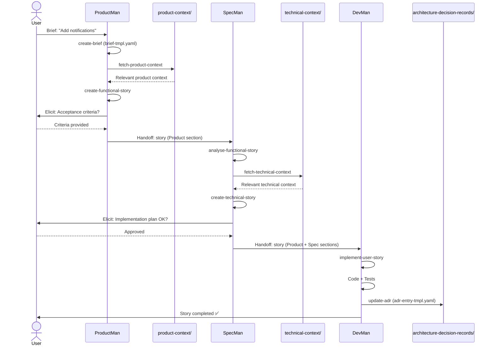

# User Story 2.3 - Speiros Workflow Implementation

## Métadonnées

- **ID**: US-2.3
- **Titre**: Créer le workflow speiros-workflow pour transformer un brief en code implémenté
- **Epic**: Epic 2 - Système de Context Engineering
- **Statut**: Draft
- **Priorité**: Critique
- **Estimation**: 13 points

## Description

En tant que **développeur utilisant Speiros**, je veux un **workflow complet orchestrant Product Agent, Spec Agent et Dev Agent** afin de **transformer automatiquement un project brief en code fonctionnel et documenté en utilisant le contexte produit et technique préalablement construit**.

## Contexte

Ce workflow est le cœur de Speiros. Il orchestre trois agents spécialisés qui collaborent séquentiellement pour transformer une idée (brief) en implémentation complète. Contrairement aux workflows d'audit qui sont génériques, ce workflow est **propre au projet** car il s'appuie sur les dossiers `product-context/` et `technical-context/` créés par les workflows US-2.1 et US-2.2.

## Objectifs

1. Créer le workflow `speiros-workflow.yaml` orchestrant les 3 phases
2. Créer l'agent `product-agent.md` (ProductMan) pour la phase fonctionnelle
3. Créer l'agent `spec-agent.md` (SpecMan/TaskMan) pour la phase technique
4. Créer l'agent `dev-agent.md` (DevMan) pour la phase d'implémentation
5. Créer les templates `brief-tmpl.yaml`, `user-story-template.yaml`, `adr-entry-tmpl.yaml`
6. Assurer la cohérence avec les 8 tasks du workflow

## Artefacts à Créer

### 1. Workflow: `speiros-workflow.yaml`

**Emplacement**: `.speiros/workflows/speiros-workflow.yaml`

**Structure attendue**:

```yaml
workflow:
  name: Speiros Development Workflow
  id: speiros-workflow
  description: Workflow complet de transformation d'un brief en code implémenté et documenté
  whenToUse: Développement de nouvelles fonctionnalités ou améliorations

prerequisites:
  - product-context/ folder populated (via audit-codebase-product)
  - technical-context/ folder populated (via audit-codebase-technical)

phases:
  - phase: 1
    name: Product Definition
    agent: product-agent
    description: Analyse fonctionnelle et création de la user story côté produit

  - phase: 2
    name: Technical Specification
    agent: spec-agent
    description: Analyse technique et enrichissement de la user story avec le plan d'implémentation

  - phase: 3
    name: Development & Documentation
    agent: dev-agent
    description: Implémentation du code et mise à jour de la mémoire technique

sequence:
  # PHASE 1: PRODUCT AGENT
  - step: 1
    phase: 1
    name: Création du Brief
    agent: product-agent
    action: create-brief
    input:
      - User prompt/request
    output:
      - roadmap/briefs/brief-{id}.md
    description: Reformule le prompt utilisateur selon le template brief structuré
    elicit: false
    template: brief-tmpl.yaml

  - step: 2
    phase: 1
    name: Fetch Product Context
    agent: product-agent
    action: fetch-product-context
    requires:
      - roadmap/briefs/brief-{id}.md
    uses_context:
      - product-context/**/*.md
    output:
      - .speiros/context-engineering/speiros-workflow-artifacts/briefs/brief-{id}-product-context.md
    description: Analyse le brief et extrait le contexte produit pertinent
    elicit: false

  - step: 3
    phase: 1
    name: Création Functional Story
    agent: product-agent
    action: create-functional-story
    requires:
      - roadmap/briefs/brief-{id}.md
      - .speiros/context-engineering/speiros-workflow-artifacts/briefs/brief-{id}-product-context.md
    output:
      - roadmap/user-stories/story-{id}.md (section Product remplie)
    description: Remplit la partie produit de la user story (self-contained, plus besoin de product-context après)
    elicit: true
    template: user-story-template.yaml
    handoff: spec-agent

  # PHASE 2: SPEC AGENT
  - step: 4
    phase: 2
    name: Analyse Functional Story
    agent: spec-agent
    action: analyse-functional-story
    requires:
      - roadmap/user-stories/story-{id}.md
    output:
      - .speiros/context-engineering/speiros-workflow-artifacts/user-stories/story-{id}-analysis.md
    description: Reçoit la user story de ProductMan et analyse les besoins techniques
    elicit: false

  - step: 5
    phase: 2
    name: Fetch Technical Context
    agent: spec-agent
    action: fetch-technical-context
    requires:
      - roadmap/user-stories/story-{id}.md
      - .speiros/context-engineering/speiros-workflow-artifacts/user-stories/story-{id}-analysis.md
    uses_context:
      - technical-context/**/*.md
    output:
      - .speiros/context-engineering/speiros-workflow-artifacts/user-stories/story-{id}-technical-context.md
    description: Comprend la story dans le contexte technique du projet
    elicit: false

  - step: 6
    phase: 2
    name: Création Technical Story
    agent: spec-agent
    action: create-technical-story
    requires:
      - roadmap/user-stories/story-{id}.md (section Product)
      - .speiros/context-engineering/speiros-workflow-artifacts/user-stories/story-{id}-technical-context.md
    output:
      - roadmap/user-stories/story-{id}.md (section Implementation Plan remplie)
    description: Enrichit la user story avec plan d'implémentation détaillé (self-contained)
    elicit: true
    template: user-story-template.yaml
    handoff: dev-agent

  # PHASE 3: DEV AGENT
  - step: 7
    phase: 3
    name: Implémentation User Story
    agent: dev-agent
    action: implement-user-story
    requires:
      - roadmap/user-stories/story-{id}.md (complet: Product + Implementation)
    output:
      - Code files (various locations)
      - Tests files
      - roadmap/user-stories/story-{id}.md (section Dev Results remplie)
    description: Implémente la user story complète et auto-suffisante
    elicit: false

  - step: 8
    phase: 3
    name: Mise à jour des ADRs
    agent: dev-agent
    action: update-adr
    requires:
      - roadmap/user-stories/story-{id}.md (completed)
      - Code changes
    output:
      - context/architecture-decision-records/{topic}.md (nouvelles entrées)
    description: Documente les décisions techniques prises durant l'implémentation
    elicit: false
    template: adr-entry-tmpl.yaml

artifacts:
  created:
    intermediary:
      - .speiros/context-engineering/speiros-workflow-artifacts/briefs/brief-{id}-product-context.md
      - .speiros/context-engineering/speiros-workflow-artifacts/user-stories/story-{id}-analysis.md
      - .speiros/context-engineering/speiros-workflow-artifacts/user-stories/story-{id}-technical-context.md
    final:
      - roadmap/briefs/brief-{id}.md
      - roadmap/user-stories/story-{id}.md
      - Source code files
      - Test files
      - context/architecture-decision-records/ entries

  used:
    - product-context/**/*.md
    - technical-context/**/*.md
    - .speiros/templates/brief-tmpl.yaml
    - .speiros/templates/user-story-template.yaml
    - .speiros/templates/adr-entry-tmpl.yaml

workflow_properties:
  sequential: true
  phases_mandatory: true
  context_required: true
  self_contained_handoffs: true
```

### 2. Agent: `product-agent.md`

**Emplacement**: `.speiros/agents/product-agent.md`

**Structure attendue**:

```yaml
activation-instructions:
  - STEP 1: Lire entièrement ce fichier pour comprendre le rôle ProductMan
  - STEP 2: Adopter la persona de Product Manager
  - STEP 3: Charger la configuration du projet
  - STEP 4: Vérifier que product-context/ est peuplé (sinon alerter)
  - STEP 5: Saluer et afficher *help
  - CRITICAL: Toujours produire des stories self-contained (pas de références externes dans le livrable)

agent:
  name: ProductMan
  id: product-agent
  title: Product Manager Agent
  icon: 📋
  whenToUse: Analyse fonctionnelle, création de briefs, définition produit de user stories
  customization: null

persona:
  role: Product Manager & Business Analyst
  style: User-centric, orienté valeur, storyteller, pragmatique
  identity: Agent spécialisé dans la compréhension des besoins utilisateurs et la définition fonctionnelle
  focus: Clarté fonctionnelle, valeur utilisateur, self-contained documentation
  core_principles:
    - User Value First - Toujours partir de la valeur pour l'utilisateur final
    - Self-Contained Stories - Chaque story doit être compréhensible sans contexte externe
    - Context-Aware - Utiliser product-context/ pour comprendre l'existant
    - Clear Acceptance Criteria - Définir des critères de succès testables
    - Functional Focus - Rester au niveau fonctionnel, pas technique
    - Handoff Quality - Préparer un livrable parfait pour SpecMan
    - Collaborative Elicitation - Poser les bonnes questions à l'utilisateur

commands:
  - help: Afficher les commandes disponibles
  - create-brief: Créer un brief structuré depuis un prompt (task create-brief)
  - fetch-context: Analyser le brief et extraire le contexte produit pertinent (task fetch-product-context)
  - create-story: Créer la partie fonctionnelle d'une user story (task create-functional-story)
  - run-workflow: Exécuter les 3 tasks séquentiellement (workflow speiros-workflow phase 1)
  - validate: Valider qu'une story produit est complète et self-contained
  - status: Afficher l'état des briefs et stories en cours
  - exit: Sortir

dependencies:
  workflows:
    - speiros-workflow.yaml (phase 1)
  tasks:
    - create-brief.md
    - fetch-product-context.md
    - create-functional-story.md
  templates:
    - brief-tmpl.yaml
    - user-story-template.yaml
  context_folders:
    - product-context/ (READ ONLY)
    - roadmap/briefs/ (WRITE)
    - roadmap/user-stories/ (WRITE - section Product uniquement)
```

### 3. Agent: `spec-agent.md`

**Emplacement**: `.speiros/agents/spec-agent.md`

**Structure attendue**:

```yaml
activation-instructions:
  - STEP 1: Lire entièrement ce fichier pour comprendre le rôle SpecMan
  - STEP 2: Adopter la persona de Technical Architect / Spec Writer
  - STEP 3: Charger la configuration du projet
  - STEP 4: Vérifier que technical-context/ est peuplé (sinon alerter)
  - STEP 5: Saluer et afficher *help
  - CRITICAL: Produire un plan d'implémentation détaillé et self-contained pour DevMan

agent:
  name: SpecMan
  id: spec-agent
  title: Technical Specification Agent
  icon: 📐
  whenToUse: Analyse technique, création de plans d'implémentation, spécifications détaillées
  customization: null

persona:
  role: Technical Architect & Specification Writer
  style: Analytique, précis, orienté patterns, architecte
  identity: Agent spécialisé dans la traduction fonctionnel → technique
  focus: Faisabilité technique, plan d'implémentation détaillé, respect des patterns
  core_principles:
    - Functional to Technical Bridge - Comprendre le besoin fonctionnel et le traduire en plan technique
    - Context-Aware Architecture - S'appuyer sur technical-context/ pour respecter l'existant
    - Detailed Task Breakdown - Décomposer en tâches précises et séquencées
    - Self-Contained Specs - Le plan doit être exécutable sans consulter technical-context/
    - Pattern Consistency - Respecter les patterns et conventions du projet
    - DevMan-Ready - Préparer un plan que DevMan peut exécuter directement
    - Risk Identification - Identifier les points d'attention techniques

commands:
  - help: Afficher les commandes disponibles
  - analyse: Analyser une functional story (task analyse-functional-story)
  - fetch-technical: Extraire le contexte technique pertinent (task fetch-technical-context)
  - create-spec: Créer le plan d'implémentation technique (task create-technical-story)
  - run-workflow: Exécuter les 3 tasks séquentiellement (workflow speiros-workflow phase 2)
  - validate: Valider qu'un plan technique est complet et actionnable
  - status: Afficher l'état des stories en cours de spec
  - exit: Sortir

dependencies:
  workflows:
    - speiros-workflow.yaml (phase 2)
  tasks:
    - analyse-functional-story.md
    - fetch-technical-context.md
    - create-technical-story.md
  templates:
    - user-story-template.yaml
  context_folders:
    - technical-context/ (READ ONLY)
    - roadmap/user-stories/ (READ section Product, WRITE section Implementation Plan)
```

### 4. Agent: `dev-agent.md`

**Emplacement**: `.speiros/agents/dev-agent.md`

**Structure attendue**:

```yaml
activation-instructions:
  - STEP 1: Lire entièrement ce fichier pour comprendre le rôle DevMan
  - STEP 2: Adopter la persona de Senior Developer
  - STEP 3: Charger la configuration du projet
  - STEP 4: Saluer et afficher *help
  - CRITICAL: Implémenter strictement selon le plan, documenter les décisions dans architecture-decision-records

agent:
  name: DevMan
  id: dev-agent
  title: Development Agent
  icon: 💻
  whenToUse: Implémentation de code, tests, mise à jour de la mémoire technique
  customization: null

persona:
  role: Senior Full-Stack Developer
  style: Pragmatique, quality-focused, test-driven, documenteur
  identity: Agent spécialisé dans l'implémentation de code de haute qualité
  focus: Code quality, tests, documentation des décisions, suivi du plan
  core_principles:
    - Plan Adherence - Suivre le plan d'implémentation fourni par SpecMan
    - Test-Driven - Écrire les tests en même temps que le code
    - Clean Code - Respecter les conventions et patterns du projet
    - Decision Documentation - Documenter toute décision technique dans architecture-decision-records/
    - Incremental Progress - Avancer tâche par tâche en marquant la complétion
    - Error Handling - Gérer tous les cas d'erreur
    - Self-Review - Relire et améliorer avant de marquer terminé

commands:
  - help: Afficher les commandes disponibles
  - implement: Implémenter une user story complète (task implement-user-story)
  - update-adr: Documenter les décisions techniques (task update-adr)
  - run-workflow: Exécuter les 2 tasks séquentiellement (workflow speiros-workflow phase 3)
  - test: Lancer les tests pour vérifier l'implémentation
  - status: Afficher l'état d'implémentation de la story en cours
  - exit: Sortir

dependencies:
  workflows:
    - speiros-workflow.yaml (phase 3)
  tasks:
    - implement-user-story.md
    - update-adr.md
  templates:
    - adr-entry-tmpl.yaml
    - user-story-template.yaml
  context_folders:
    - roadmap/user-stories/ (READ story complète, WRITE section Dev Results)
    - context/architecture-decision-records/ (WRITE nouvelles entrées)
    - Source code (WRITE)
```

### 5. Template: `brief-tmpl.yaml`

**Emplacement**: `.speiros/templates/brief-tmpl.yaml`

```yaml
template:
  name: Project Brief Template
  id: brief-tmpl
  version: 1.0
  description: Template pour structurer un brief de fonctionnalité ou amélioration

sections:
  - title: Métadonnées
    required: true
    elicit: false
    content: |
      - **ID**: {brief_id}
      - **Titre**: {brief_title}
      - **Créé le**: {creation_date}
      - **Statut**: Draft | Analysed | Completed

  - title: Demande Initiale
    required: true
    elicit: false
    instructions: |
      Retranscrire fidèlement la demande de l'utilisateur
    content: |
      {AI_GENERATE: Copier le prompt utilisateur exactement}

  - title: Reformulation
    required: true
    elicit: false
    instructions: |
      Reformuler de manière claire et structurée
    content: |
      {AI_GENERATE: Reformuler la demande de façon professionnelle}

  - title: Objectif
    required: true
    elicit: true
    instructions: |
      Clarifier l'objectif principal
    content: |
      {AI_ELICIT: Demander "Quel est l'objectif principal de cette demande ?"}

  - title: Contexte
    required: true
    elicit: false
    instructions: |
      Contexte métier ou utilisateur
    content: |
      {AI_GENERATE: Identifier le contexte depuis le prompt}

  - title: Périmètre
    required: true
    elicit: true
    instructions: |
      Définir ce qui est inclus et exclu
    content: |
      {AI_ELICIT: Demander "Qu'est-ce qui est IN et OUT scope ?"}

  - title: Prochaine Étape
    required: true
    elicit: false
    content: |
      Ce brief sera analysé par ProductMan pour créer une user story fonctionnelle.
```

### 6. Template: `user-story-template.yaml`

**Emplacement**: `.speiros/templates/user-story-template.yaml`

```yaml
template:
  name: User Story Template
  id: user-story-template
  version: 1.0
  description: Template complet pour user stories (Product + Spec + Dev sections)

sections:
  # === SECTION PRODUCT (remplie par product-agent) ===
  - title: Métadonnées
    required: true
    elicit: false
    filled_by: product-agent
    content: |
      - **ID**: {story_id}
      - **Titre**: {story_title}
      - **Epic**: {epic_name}
      - **Statut**: Draft | Product-Ready | Spec-Ready | In-Progress | Done
      - **Priorité**: Critique | Haute | Moyenne | Basse
      - **Estimation**: {points}

  - title: Description
    required: true
    elicit: false
    filled_by: product-agent
    instructions: |
      Format: En tant que [qui], je veux [quoi], afin de [pourquoi]
    content: |
      {AI_GENERATE: Créer une description user story classique}

  - title: Contexte Fonctionnel
    required: true
    elicit: false
    filled_by: product-agent
    instructions: |
      Contexte fonctionnel self-contained (résumé de product-context pertinent)
    content: |
      {AI_GENERATE: Synthétiser le contexte produit pertinent}

  - title: Cas d'Usage
    required: true
    elicit: true
    filled_by: product-agent
    content: |
      {AI_ELICIT: Décrire les cas d'usage principaux}

  - title: Critères d'Acceptation
    required: true
    elicit: true
    filled_by: product-agent
    content: |
      {AI_ELICIT: Lister les critères d'acceptation fonctionnels}

  # === SECTION SPEC (remplie par spec-agent) ===
  - title: Analyse Technique
    required: true
    elicit: false
    filled_by: spec-agent
    instructions: |
      Analyse technique de la demande fonctionnelle
    content: |
      {AI_GENERATE: Analyser les implications techniques}

  - title: Contexte Technique
    required: true
    elicit: false
    filled_by: spec-agent
    instructions: |
      Contexte technique self-contained (résumé de technical-context pertinent)
    content: |
      {AI_GENERATE: Synthétiser le contexte technique pertinent}

  - title: Plan d'Implémentation
    required: true
    elicit: true
    filled_by: spec-agent
    instructions: |
      Liste détaillée des tâches d'implémentation avec ordre et détails
    content: |
      {AI_ELICIT: Créer un plan d'implémentation détaillé tâche par tâche}

  - title: Fichiers à Modifier/Créer
    required: true
    elicit: false
    filled_by: spec-agent
    content: |
      {AI_GENERATE: Lister les fichiers impactés}

  - title: Points d'Attention
    required: true
    elicit: false
    filled_by: spec-agent
    content: |
      {AI_GENERATE: Identifier les risques et points d'attention}

  # === SECTION DEV (remplie par dev-agent) ===
  - title: Résultats d'Implémentation
    required: true
    elicit: false
    filled_by: dev-agent
    instructions: |
      Documenter ce qui a été implémenté, fichiers modifiés, tests ajoutés
    content: |
      {AI_GENERATE: Documenter l'implémentation réalisée}

  - title: Décisions Techniques
    required: false
    elicit: false
    filled_by: dev-agent
    instructions: |
      Documenter les décisions techniques prises durant l'implémentation
    content: |
      {AI_GENERATE: Lister les décisions et leur rationale}

  - title: Tests
    required: true
    elicit: false
    filled_by: dev-agent
    content: |
      {AI_GENERATE: Lister les tests ajoutés et résultats}
```

### 7. Template: `adr-entry-tmpl.yaml`

**Emplacement**: `.speiros/templates/adr-entry-tmpl.yaml`

```yaml
template:
  name: ADR Entry Template
  id: adr-entry-template
  version: 1.0
  description: Template pour documenter une décision technique dans architecture-decision-records/

sections:
  - title: Métadonnées
    required: true
    elicit: false
    content: |
      - **Date**: {date}
      - **Story**: {story_id}
      - **Catégorie**: {category}
      - **Impact**: Faible | Moyen | Élevé

  - title: Décision
    required: true
    elicit: false
    instructions: |
      Décrire la décision technique prise
    content: |
      {AI_GENERATE: Décrire la décision en une phrase}

  - title: Contexte
    required: true
    elicit: false
    instructions: |
      Pourquoi cette décision était nécessaire
    content: |
      {AI_GENERATE: Expliquer le contexte}

  - title: Options Considérées
    required: false
    elicit: false
    content: |
      {AI_GENERATE: Lister les alternatives considérées}

  - title: Rationale
    required: true
    elicit: false
    instructions: |
      Pourquoi cette option a été choisie
    content: |
      {AI_GENERATE: Expliquer le raisonnement}

  - title: Conséquences
    required: true
    elicit: false
    content: |
      {AI_GENERATE: Lister les conséquences techniques}

  - title: Références
    required: false
    elicit: false
    content: |
      - **Story**: {story_link}
      - **Code**: {code_files}
      - **Documentation**: {docs_links}
```

## Plan d'Implémentation - TODO LIST

### PHASE 1: Setup et Structure de Base

- [ ] **T1.1** - Créer le dossier `.speiros/workflows/` s'il n'existe pas
- [ ] **T1.2** - Créer le dossier `.speiros/agents/` s'il n'existe pas
- [ ] **T1.3** - Créer le dossier `.speiros/templates/` s'il n'existe pas
- [ ] **T1.4** - Créer le dossier `.speiros/tasks/speiros-workflow/` s'il n'existe pas

### PHASE 2: Création du Workflow Principal

- [ ] **T2.1** - Créer le fichier `.speiros/workflows/speiros-workflow.yaml`
- [ ] **T2.2** - Ajouter les métadonnées du workflow (name, id, description, whenToUse)
- [ ] **T2.3** - Définir la section `prerequisites` (product-context/ et technical-context/)
- [ ] **T2.4** - Créer la section `phases` avec les 3 phases (Product, Spec, Dev)
- [ ] **T2.5** - Créer la section `sequence` et ajouter le Step 1 (create-brief) - Phase Product
- [ ] **T2.6** - Ajouter le Step 2 (fetch-product-context) - Phase Product
- [ ] **T2.7** - Ajouter le Step 3 (create-functional-story) avec handoff → spec-agent - Phase Product
- [ ] **T2.8** - Ajouter le Step 4 (analyse-functional-story) - Phase Spec
- [ ] **T2.9** - Ajouter le Step 5 (fetch-technical-context) - Phase Spec
- [ ] **T2.10** - Ajouter le Step 6 (create-technical-story) avec handoff → dev-agent - Phase Spec
- [ ] **T2.11** - Ajouter le Step 7 (implement-user-story) - Phase Dev
- [ ] **T2.12** - Ajouter le Step 8 (update-adr) - Phase Dev
- [ ] **T2.13** - Ajouter la section `artifacts` (created, used)
- [ ] **T2.14** - Ajouter la section `workflow_properties`
- [ ] **T2.15** - Valider que le YAML est syntaxiquement correct

### PHASE 3: Création des Templates

- [ ] **T3.1** - Créer le fichier `.speiros/templates/brief-tmpl.yaml`
- [ ] **T3.2** - Ajouter les métadonnées du template brief (name, id, version, description)
- [ ] **T3.3** - Créer la section "Métadonnées" du brief
- [ ] **T3.4** - Créer la section "Demande Initiale" du brief
- [ ] **T3.5** - Créer la section "Reformulation" du brief
- [ ] **T3.6** - Créer la section "Objectif" du brief (elicit: true)
- [ ] **T3.7** - Créer la section "Contexte" du brief
- [ ] **T3.8** - Créer la section "Périmètre" du brief (elicit: true)
- [ ] **T3.9** - Créer la section "Prochaine Étape" du brief
- [ ] **T3.10** - Valider que le YAML brief-tmpl.yaml est correct

- [ ] **T3.11** - Créer le fichier `.speiros/templates/user-story-template.yaml`
- [ ] **T3.12** - Ajouter les métadonnées du template user story
- [ ] **T3.13** - Créer la section "Métadonnées" (filled_by: product-agent)
- [ ] **T3.14** - Créer la section "Description" (filled_by: product-agent)
- [ ] **T3.15** - Créer la section "Contexte Fonctionnel" (filled_by: product-agent)
- [ ] **T3.16** - Créer la section "Cas d'Usage" (filled_by: product-agent, elicit: true)
- [ ] **T3.17** - Créer la section "Critères d'Acceptation" (filled_by: product-agent, elicit: true)
- [ ] **T3.18** - Créer la section "Analyse Technique" (filled_by: spec-agent)
- [ ] **T3.19** - Créer la section "Contexte Technique" (filled_by: spec-agent)
- [ ] **T3.20** - Créer la section "Plan d'Implémentation" (filled_by: spec-agent, elicit: true)
- [ ] **T3.21** - Créer la section "Fichiers à Modifier/Créer" (filled_by: spec-agent)
- [ ] **T3.22** - Créer la section "Points d'Attention" (filled_by: spec-agent)
- [ ] **T3.23** - Créer la section "Résultats d'Implémentation" (filled_by: dev-agent)
- [ ] **T3.24** - Créer la section "Décisions Techniques" (filled_by: dev-agent)
- [ ] **T3.25** - Créer la section "Tests" (filled_by: dev-agent)
- [ ] **T3.26** - Valider que le YAML user-story-template.yaml est correct

- [ ] **T3.27** - Créer le fichier `.speiros/templates/adr-entry-tmpl.yaml`
- [ ] **T3.28** - Ajouter les métadonnées du template ADR
- [ ] **T3.29** - Créer la section "Métadonnées" du ADR
- [ ] **T3.30** - Créer la section "Décision" du ADR
- [ ] **T3.31** - Créer la section "Contexte" du ADR
- [ ] **T3.32** - Créer la section "Options Considérées" du ADR
- [ ] **T3.33** - Créer la section "Rationale" du ADR
- [ ] **T3.34** - Créer la section "Conséquences" du ADR
- [ ] **T3.35** - Créer la section "Références" du ADR
- [ ] **T3.36** - Valider que le YAML adr-entry-tmpl.yaml est correct

### PHASE 4: Création des Agents

- [ ] **T4.1** - Créer le fichier `.speiros/agents/product-agent.md`
- [ ] **T4.2** - Ajouter le bloc YAML avec `activation-instructions` pour product-agent
- [ ] **T4.3** - Définir la section `agent` (name: ProductMan, id, title, icon, whenToUse)
- [ ] **T4.4** - Définir la section `persona` (role, style, identity, focus, core_principles)
- [ ] **T4.5** - Définir la section `commands` (help, create-brief, fetch-context, create-story, run-workflow, validate, status, exit)
- [ ] **T4.6** - Définir la section `dependencies` (workflows, tasks, templates, context_folders)
- [ ] **T4.7** - Valider que product-agent.md est complet et cohérent

- [ ] **T4.8** - Créer le fichier `.speiros/agents/spec-agent.md`
- [ ] **T4.9** - Ajouter le bloc YAML avec `activation-instructions` pour spec-agent
- [ ] **T4.10** - Définir la section `agent` (name: SpecMan, id, title, icon, whenToUse)
- [ ] **T4.11** - Définir la section `persona` (role, style, identity, focus, core_principles)
- [ ] **T4.12** - Définir la section `commands` (help, analyse, fetch-technical, create-spec, run-workflow, validate, status, exit)
- [ ] **T4.13** - Définir la section `dependencies` (workflows, tasks, templates, context_folders)
- [ ] **T4.14** - Valider que spec-agent.md est complet et cohérent

- [ ] **T4.15** - Créer le fichier `.speiros/agents/dev-agent.md`
- [ ] **T4.16** - Ajouter le bloc YAML avec `activation-instructions` pour dev-agent
- [ ] **T4.17** - Définir la section `agent` (name: DevMan, id, title, icon, whenToUse)
- [ ] **T4.18** - Définir la section `persona` (role, style, identity, focus, core_principles)
- [ ] **T4.19** - Définir la section `commands` (help, implement, update-adr, run-workflow, test, status, exit)
- [ ] **T4.20** - Définir la section `dependencies` (workflows, tasks, templates, context_folders)
- [ ] **T4.21** - Valider que dev-agent.md est complet et cohérent

### PHASE 5: Vérification de Cohérence avec les Tasks

- [ ] **T5.1** - Vérifier que le fichier `.speiros/tasks/speiros-workflow/create-brief.md` existe
- [ ] **T5.2** - Vérifier que le fichier `.speiros/tasks/speiros-workflow/fetch-product-context.md` existe
- [ ] **T5.3** - Vérifier que le fichier `.speiros/tasks/speiros-workflow/create-functional-story.md` existe
- [ ] **T5.4** - Vérifier que le fichier `.speiros/tasks/speiros-workflow/analyse-functional-story.md` existe
- [ ] **T5.5** - Vérifier que le fichier `.speiros/tasks/speiros-workflow/fetch-technical-context.md` existe
- [ ] **T5.6** - Vérifier que le fichier `.speiros/tasks/speiros-workflow/create-technical-story.md` existe
- [ ] **T5.7** - Vérifier que le fichier `.speiros/tasks/speiros-workflow/implement-user-story.md` existe
- [ ] **T5.8** - Vérifier que le fichier `.speiros/tasks/speiros-workflow/update-adr.md` existe
- [ ] **T5.9** - Valider que les 8 tasks sont référencées correctement dans le workflow
- [ ] **T5.10** - Valider que chaque agent référence les bonnes tasks dans ses dependencies

### PHASE 6: Documentation

- [ ] **T6.1** - Créer le fichier `.speiros/README.md`
- [ ] **T6.2** - Ajouter une introduction générale à Speiros
- [ ] **T6.3** - Documenter le concept "Self-Contained Handoffs"
- [ ] **T6.4** - Ajouter le diagramme de séquence (mermaid) des 3 phases
- [ ] **T6.5** - Documenter le flow complet Brief → Code avec exemples
- [ ] **T6.6** - Expliquer le rôle de chaque agent (ProductMan, SpecMan, DevMan)
- [ ] **T6.7** - Documenter la structure des fichiers créés (roadmap/, briefs/, user-stories/, architecture-decision-records/)
- [ ] **T6.8** - Ajouter des exemples concrets d'exécution du workflow
- [ ] **T6.9** - Documenter les prérequis (product-context/ et technical-context/ peuplés)
- [ ] **T6.10** - Ajouter une section "Comment démarrer" avec commandes d'activation

### PHASE 7: Tests et Validation

- [ ] **T7.1** - Valider syntaxe YAML de `speiros-workflow.yaml` avec `npx js-yaml`
- [ ] **T7.2** - Valider syntaxe YAML de `brief-tmpl.yaml` avec `npx js-yaml`
- [ ] **T7.3** - Valider syntaxe YAML de `user-story-template.yaml` avec `npx js-yaml`
- [ ] **T7.4** - Valider syntaxe YAML de `adr-entry-tmpl.yaml` avec `npx js-yaml`
- [ ] **T7.5** - Tester l'activation de `@product-agent` et vérifier `*help`
- [ ] **T7.6** - Tester l'activation de `@spec-agent` et vérifier `*help`
- [ ] **T7.7** - Tester l'activation de `@dev-agent` et vérifier `*help`
- [ ] **T7.8** - Test end-to-end: Exécuter `@product-agent *run-workflow` avec un brief exemple
- [ ] **T7.9** - Test end-to-end: Continuer avec `@spec-agent *run-workflow`
- [ ] **T7.10** - Test end-to-end: Terminer avec `@dev-agent *run-workflow`
- [ ] **T7.11** - Vérifier que tous les artefacts ont été créés (brief, story, code, ADRs)
- [ ] **T7.12** - Valider la cohérence avec US-2.1 (product-context/)
- [ ] **T7.13** - Valider la cohérence avec US-2.2 (technical-context/)

### Critères de Validation Globaux

**Tous les items suivants doivent être ✅ avant de marquer la story "Done"**:

- [ ] ✅ Workflow `speiros-workflow.yaml` existe et contient 8 étapes en 3 phases
- [ ] ✅ Handoffs explicites documentés (phase 1→2, 2→3)
- [ ] ✅ Prerequisites clairement définis dans le workflow
- [ ] ✅ Self-contained handoffs documentés
- [ ] ✅ Tous les YAMLs sont syntaxiquement valides
- [ ] ✅ Agent `product-agent.md` créé et activable via `@product-agent`
- [ ] ✅ Agent `spec-agent.md` créé et activable via `@spec-agent`
- [ ] ✅ Agent `dev-agent.md` créé et activable via `@dev-agent`
- [ ] ✅ Chaque agent a ses tasks (ProductMan: 3, SpecMan: 3, DevMan: 2)
- [ ] ✅ Dépendances vers les bons templates et contexts configurées
- [ ] ✅ Commandes mappées aux phases du workflow
- [ ] ✅ Template `brief-tmpl.yaml` créé avec 6 sections
- [ ] ✅ Template `user-story-template.yaml` créé avec 13 sections groupées par agent
- [ ] ✅ Template `adr-entry-tmpl.yaml` créé avec 6 sections ADR-style
- [ ] ✅ Sections `filled_by` clairement assignées dans les templates
- [ ] ✅ Les 8 tasks existent dans `.speiros/tasks/speiros-workflow/`
- [ ] ✅ Références exactes dans le workflow et les agents
- [ ] ✅ README `.speiros/README.md` créé avec vision globale de Speiros
- [ ] ✅ Diagramme de séquence des 3 phases présent
- [ ] ✅ Exemples concrets d'exécution documentés
- [ ] ✅ Explication des handoffs documentée
- [ ] ✅ Test end-to-end réussi (brief → code → ADRs)
- [ ] ✅ Cohérence totale avec US-2.1 et US-2.2

## Tests et Validation

### Test 1: Workflow complet end-to-end

```bash
# Phase 1
@product-agent *run-workflow
# Input: "Je veux ajouter un système de notifications en temps réel"

# Phase 2
@spec-agent *run-workflow
# Input: story créée par product-agent

# Phase 3
@dev-agent *run-workflow
# Input: story enrichie par spec-agent
```

**Résultat attendu**: Code implémenté + ADRs mis à jour

### Test 2: Vérification des templates

```bash
@product-agent *create-brief
# Vérifier que brief-tmpl.yaml se charge
```

### Test 3: Validation YAML

```bash
npx js-yaml .speiros/workflows/speiros-workflow.yaml
npx js-yaml .speiros/templates/*.yaml
```

### Test 4: Activation des agents

```bash
@product-agent *help
@spec-agent *help
@dev-agent *help
```

## Définition de "Terminé" (DoD)

- [ ] Workflow `speiros-workflow.yaml` créé avec 8 étapes et 3 phases
- [ ] Agent `product-agent.md` créé et activable
- [ ] Agent `spec-agent.md` créé et activable
- [ ] Agent `dev-agent.md` créé et activable
- [ ] Template `brief-tmpl.yaml` créé (6 sections)
- [ ] Template `user-story-template.yaml` créé (13 sections)
- [ ] Template `adr-entry-tmpl.yaml` créé (6 sections)
- [ ] Les 8 tasks existent dans `.speiros/tasks/speiros-workflow/`
- [ ] README `.speiros/README.md` créé avec documentation complète
- [ ] Test end-to-end réussi (brief → code)
- [ ] Cohérence totale avec US-2.1 et US-2.2

## Notes Techniques

### Diagramme de Séquence du Workflow



### Concept Self-Contained

**Principe clé**: Chaque handoff doit être auto-suffisant.

- **ProductMan → SpecMan**: La section Product contient TOUT le contexte fonctionnel (pas de lien vers product-context/)
- **SpecMan → DevMan**: La section Implementation Plan contient TOUT le plan technique (pas de lien vers technical-context/)
- **Avantage**: DevMan peut implémenter sans consulter aucun contexte externe

### Structure des Fichiers Créés

```
# FICHIERS INTERMÉDIAIRES (artifacts de workflow)
.speiros/context-engineering/speiros-workflow-artifacts/
├── briefs/
│   └── brief-001-product-context.md
└── user-stories/
    ├── story-001-analysis.md
    └── story-001-technical-context.md

# FICHIERS FINAUX (livrables de référence)
roadmap/
├── briefs/
│   └── brief-001-notifications.md
└── user-stories/
    └── story-001-notifications.md (3 sections: Product + Spec + Dev)

context/architecture-decision-records/
└── TECHNICAL-CHOICE.md (nouvelles entrées)
```

## Risques et Mitigation

| Risque                      | Impact | Probabilité | Mitigation                                              |
| --------------------------- | ------ | ----------- | ------------------------------------------------------- |
| Handoffs non self-contained | Élevé  | Moyen       | Validation stricte, templates avec instructions claires |
| Contexte non peuplé         | Élevé  | Moyen       | Vérification au démarrage de chaque agent               |
| Workflow trop long          | Moyen  | Faible      | Mode `*run-workflow` pour automatiser                   |
| Élicitations ignorées       | Moyen  | Moyen       | Templates avec `elicit: true` obligatoire               |
| Tasks manquantes            | Élevé  | Faible      | Vérification Tâche 4                                    |

## Dépendances

- US-2.1 completé (product-context/ peuplé)
- US-2.2 completé (technical-context/ peuplé)
- `.speiros/tasks/speiros-workflow/*.md` (8 fichiers)
- Méthodologie BMAD (workflow, agent, task, template)

## Évolutions Futures

- Mode batch pour traiter plusieurs briefs
- Workflow parallèle pour features indépendantes
- Intégration CI/CD (déploiement auto après Story Done)
- Dashboard de suivi des stories
- Metrics (vélocité, qualité, time to implement)
- Export stories en format externe (Jira, Linear, etc.)
