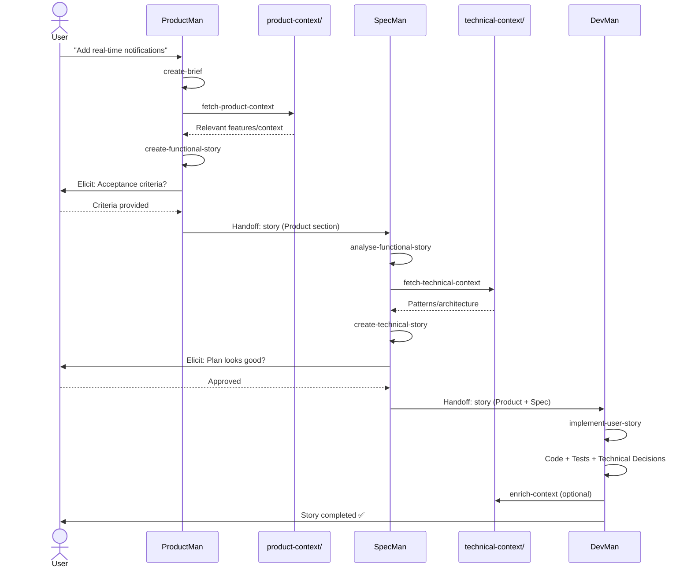

# Speiros - Context Engineering System

Speiros is an AI-driven development system that transforms briefs into production code through three specialized agents collaborating via self-contained handoffs. test

---

## 📖 Documentation

- **[This file]** - Speiros system overview
- **[/context/README.md](../context/README.md)** - Reference documentation (product + technical)
- **[/roadmap/README.md](../roadmap/README.md)** - Roadmap and user stories guide
- **[artifacts/README.md](./artifacts/README.md)** - Intermediate artifacts guide

---

## Overview

Speiros orchestrates three phases:

1. **Product Phase** - ProductMan creates functional user story from brief
2. **Spec Phase** - SpecMan adds detailed implementation plan
3. **Dev Phase** - DevMan implements code and updates technical memory

## Core Concept: Self-Contained Handoffs

Each agent produces **self-contained** deliverables. When ProductMan hands off to SpecMan, the story contains ALL functional context needed. When SpecMan hands off to DevMan, the story contains ALL technical context needed. DevMan never needs to consult external documentation.

This is achieved by:

- Agents fetch context from `context/product/` and `context/technical/`
- Agents synthesize relevant information INTO the story
- Stories are complete, standalone documents

## Workflows

### Audit Workflows (One-time)

Run these once to build context:

```bash
@context-agent *run-workflow audit-codebase-product
@context-agent *run-workflow audit-codebase-technical
```

Creates:

- `context/product/` - Features, users, business rules
- `context/technical/` - Architecture, patterns, tools

### Speiros Workflow (Feature Development)

Transform brief → code:

```bash
# Phase 1: Product
@product-agent *run-workflow
# Input: Your feature request
# Output: Functional user story (Product section)

# Phase 2: Spec
@spec-agent *run-workflow
# Input: Story from ProductMan
# Output: Story + Implementation Plan (Spec section)

# Phase 3: Dev
@dev-agent *run-workflow
# Input: Complete story from SpecMan
# Output: Code + Tests + Memory updates
```

## Agents

### ProductMan (`@product-agent`)

- **Role**: Product Manager
- **Focus**: User value, functional clarity
- **Commands**: `create-brief`, `fetch-context`, `create-story`, `run-workflow`
- **Output**: Self-contained functional user story

### SpecMan (`@spec-agent`)

- **Role**: Technical Architect
- **Focus**: Implementation plan, patterns, feasibility
- **Commands**: `analyse`, `fetch-technical`, `create-spec`, `run-workflow`
- **Output**: Detailed, actionable implementation plan

### DevMan (`@dev-agent`)

- **Role**: Senior Developer
- **Focus**: Code quality, tests, decision documentation
- **Commands**: `implement`, `enrich-context`, `run-workflow`, `test`
- **Output**: Production code, tests, enriched technical context

## File Structure

```
monorepo-boucleai/
│
├── context/                             # 🆕 Reference documentation (at root)
│   ├── README.md
│   ├── product/                         # Product context
│   │   ├── authentication/
│   │   ├── organization/
│   │   ├── github-integration/
│   │   ├── user-management/
│   │   ├── administration/
│   │   ├── repository-dashboard/
│   │   └── README.md
│   └── technical/                       # Technical context
│       ├── context/                     # Domains (API, DB, Tests, etc.)
│       ├── tools/                       # Tools (Clerk, Drizzle, Sentry, etc.)

│       └── README.md
│
├── roadmap/                             # 🆕 Development roadmap (at root)
│   ├── README.md
│   ├── briefs/                          # Feature briefs
│   ├── epics/                           # Epics (story groups)
│   └── user-stories/                    # User stories
│       ├── user-story-1.1-frontend-triple-panel.md
│       ├── user-story-1.2-backend-markdown-api.md
│       └── ...
│
└── .speiros/                            # Configuration and intermediate artifacts
    ├── README.md (this file)
    ├── workflows/
    │   ├── audit-codebase-product.yaml
    │   ├── audit-codebase-technical.yaml
    │   └── speiros-workflow.yaml
    ├── tasks/
    │   ├── audit-codebase-product/      # 6 tasks for product audit
    │   ├── audit-codebase-technical/    # 6 tasks for technical audit
    │   └── speiros-workflow/            # 8 tasks for Speiros workflow
    ├── templates/
    │   ├── audit-codebase/
    │   ├── speiros-workflow/
    │   └── memory-entry-tmpl.yaml
    ├── checklists/
    └── artifacts/                       # 🆕 Intermediate workflow artifacts
        ├── README.md
        ├── audit-product/               # Product audit artifacts
        │   ├── initial-summary.md
        │   ├── audit-results.md
        │   ├── enrichment-qa.md
        │   ├── structure-plan.md
        │   └── research/
        ├── audit-technical/             # Technical audit artifacts
        │   ├── initial-summary.md
        │   ├── audit-results.md
        │   ├── enrichment-qa.md
        │   ├── structure-plan.md
        │   └── research/
        └── speiros-workflow/            # Speiros workflow artifacts
            ├── briefs/
            └── user-stories/
```

## Workflow Sequence



## Quick Start

### 1. Initial Setup (one time only)

Build product and technical contexts:

```bash
# Build product context
@context-agent *run-workflow audit-codebase-product

# Build technical context
@context-agent *run-workflow audit-codebase-technical
```

**Estimated duration**: 30-40 minutes for both workflows

**Result**:

- `context/product/` folder with functional documentation
- `context/technical/` folder with technical documentation

### 2. Develop Features

Once contexts are created, use the Speiros workflow to develop:

```bash
# Phase 1: Product Definition
@product-agent *run-workflow
> "I want to add notifications for important events"

# Phase 2: Technical Specification
@spec-agent *run-workflow

# Phase 3: Development & Documentation
@dev-agent *run-workflow
```

**Result**:

- Brief in `roadmap/briefs/`
- Complete user story in `roadmap/user-stories/` (with Technical Decisions in Dev Results)
- Implemented code in source files
- Enriched technical context in `context/technical/`

### 3. Alternative Commands

You can also use shortcut commands:

```bash
# Audit workflows
@context-agent *audit-product      # Equivalent to *run-workflow audit-codebase-product
@context-agent *audit-technical    # Equivalent to *run-workflow audit-codebase-technical

# Check status
@context-agent *status             # Shows context status

# Help
@context-agent *help               # Lists all available commands
```

## Key Principles

1. **Self-Contained Handoffs** - Each deliverable is complete and standalone
2. **Context-Aware** - Agents use context/product/ and context/technical/
3. **Sequential Phases** - Product → Spec → Dev (no skipping)
4. **User Collaboration** - Elicitation points ensure alignment
5. **Memory Building** - All decisions documented for future reference

## Templates

- **brief-tmpl.yaml** - Structured feature brief
- **user-story-speiros.yaml** - Complete story (Product + Spec + Dev sections with Technical Decisions)

## Important Notes

**Deliverables Structure**:

- **Reference documentation**: At root in `context/product/` and `context/technical/`
- **Roadmap and user stories**: At root in `roadmap/`
- **Intermediate artifacts**: In `.speiros/artifacts/` (audit-product, audit-technical, speiros-workflow)
- **System configuration**: In `.speiros/` (workflows, tasks, templates)

**Available Workflows**:

- `audit-codebase-product`: Generates product documentation (features, use cases) → `context/product/`
- `audit-codebase-technical`: Generates technical documentation (architecture, tools, patterns) → `context/technical/`
- `speiros-workflow`: Complete development workflow (Product → Spec → Dev) → `roadmap/` + code

**Organization v3.0** (US-3.1):

This version restructures deliverables for better clarity:

- `/context/` - Stable reference documentation
- `/roadmap/` - Active development and planning
- `.speiros/artifacts/` - Intermediate workflow artifacts

For more details, consult the respective README files in each folder.

## FAQ

**Q: Can I skip ProductMan if I have technical details?**
A: No. ProductMan ensures functional clarity and user value focus.

**Q: Can DevMan work without SpecMan's plan?**
A: No. SpecMan ensures technical consistency and appropriate architecture.

**Q: How to update product/technical context?**
A: Re-run audit workflows or manually update context files.

**Q: What if I disagree with the implementation plan?**
A: Provide feedback during SpecMan's elicitation step. He will adjust the plan.

## License

See project LICENSE file.
